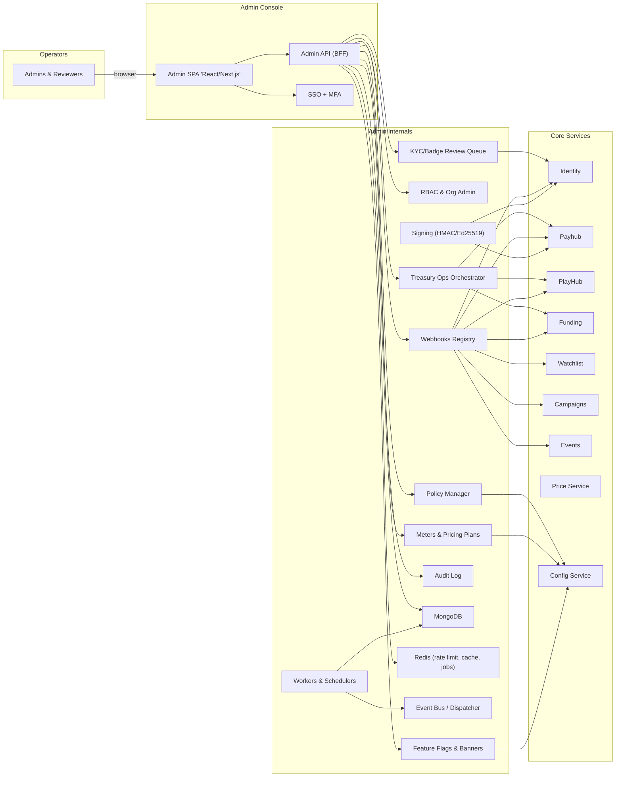

# Miniapp Admin
*Version:* v0.2.0  
*Last Updated:* 2025-09-24 03:22 +07  
*Owner:* FUZE Operations Engineering — Admin Dashboard

> High‑level architectural blueprint for the **Admin Dashboard**. This repo delivers the operator console for finance ops, support, moderation, growth, and game ops. It implements a **UI + BFF** pattern: the browser never calls core services directly; every sensitive action is proxied through the Admin BFF with strict **RBAC**, **two‑person approvals**, idempotency, and full **audit logs**.

---

## 1) Architecture Diagram (HLD)

*Notes:* The BFF signs **service‑to‑service** requests with a service JWT. All privileged mutations require **capability checks** on the staff role and may require **two approvals** before execution (e.g., withdrawals, manual credits, forced settles).

---

## 2) Technology Stack
| Layer | Choice | Rationale |
|---|---|---|
| UI | React or Next.js (SPA) | Fast internal tooling, familiar stack |
| BFF | Node.js + Express + Zod | Simple, secure request validation and DTOs |
| Auth | OIDC with Identity or Staff Token | Centralized roles and entitlements |
| Storage | MongoDB | Append‑only audit logs, admin prefs, approval queue |
| Cache | Redis | Sessions, rate limits, CSRF nonces, short‑term approvals |
| Telemetry | OpenTelemetry + Pino | Uniform tracing and logs |
| Deploy | Docker + Helm | Same pipeline as other services |

---

## 3) Responsibilities and Scope
**Owns**
- Staff authentication, session management, RBAC and capability gating.  
- Read views across **Payhub**, **PlayHub**, **Funding**, **Escrow**, **Campaigns**, **Watchlist**, **Events**, **Price**.  
- Sensitive actions behind **two‑person approvals** (4‑eyes): withdrawal approve, manual deposit credit, force settle, dispute resolve, CFB recompute.  
- Full **audit** of every admin action with immutable history and exports.  
- Operator UX: search users, drill into balances, matches, bets, escrows, sales, claims, events.

**Out of scope**
- End‑user features and gameplay UI.  
- Long‑running jobs (Workers handle them).  
- Ledger math or price computation.

---

## 4) Primary Surfaces (UI)
- **Dashboard**: system health, recent audits, fast links.  
- **Users**: profile, roles, balances, recent actions.  
- **Finance**: accounts, ledger, holds, settlements, conversions; withdrawals review; manual credits.  
- **PlayHub**: rooms, matches, **CFB** bets, result summaries; safe recompute and force settle.  
- **Funding**: sales, purchases, allocations, vesting schedules; refunds.  
- **Escrow**: contracts, disputes; adjudication tools.  
- **Campaigns**: campaigns, claims; retry queue view.  
- **Watchlist**: sources and profiles moderation.  
- **Events**: submissions, approvals, catalog edits.  
- **Price**: snapshots and reports for audits.  
- **Approvals**: pending requests requiring a second approver.  
- **Audit**: export by time range and action type.

---

## 5) Critical Flows
### 5.1 Badge policy update → propagate

### 5.2 KYC/Badge review (approve)

### 5.3 Treasury manual credit (two-man rule)

### 5.4 Webhook endpoint rotation

---

## 6) Security and Compliance
- **RBAC** with capabilities per route (e.g., `finance.withdrawals.approve`).  
- **Two‑person rule** for high‑risk ops; enforced in BFF with ApprovalRequest.  
- **CSRF** protection for state‑changing routes; SameSite and secure cookies.  
- **Sessions** short TTL and rotation; IP and UA hints for anomaly detection.  
- **Input validation** with Zod; all writes require `Idempotency-Key`.  
- **Audit** every admin action with request id and payload hash.  
- **Secrets** in secret manager; never in client.  
- **Allow lists** for service JWT audiences and issuers; optional mTLS.  
- **PII** avoidance: use user ids; never store sensitive personal data.

---

## 7) Scalability and Reliability
- Stateless BFF nodes; horizontal scale.  
- Redis for sessions and rate limits; MongoDB for audits and approvals.  
- Idempotent mutations; retries safe with idempotency keys.  
- SLOs: p95 < 150 ms for read operations.  
- Health probes `/healthz` and `/readyz` include DB, Redis, JWKS freshness.  
- DR: backups for audit logs; key rotation runbooks.

---

## 8) Observability
- **Tracing**: propagate `requestId`; spans include target service and action.  
- **Metrics**: approvals pending, approval latency, error rates, downstream latency.  
- **Logs**: structured and redacted; include actor id and action.  
- **Alerts**: surge in sensitive actions, repeated auth failures, downstream outage.

---

## 9) User Stories and Feature List
### Feature List
- Staff login and session management.  
- Cross‑service read dashboards.  
- Two‑person approvals for sensitive ops.  
- CFB oversight and safe recompute.  
- Withdrawals review and manual credits.  
- Full audit and exports.

### User Stories
- *As a finance operator*, I approve withdrawals with two‑person controls and see clear receipts.  
- *As a game operator*, I inspect a match or CFB bet and trigger a safe recompute if callbacks failed.  
- *As support*, I search a user and view their balances and recent actions.  
- *As compliance*, I export audit logs and review sensitive actions.

---

## 10) Compatibility Notes
- Works with **Identity** JWKS and staff roles.  
- Proxies to **Payhub**, **PlayHub**, **Funding**, **Escrow**, **Campaigns**, **Watchlist**, **Events**, **Price**, **Workers** using service JWTs.  
- Never exposes internal service credentials to the browser; all calls go through the BFF.
