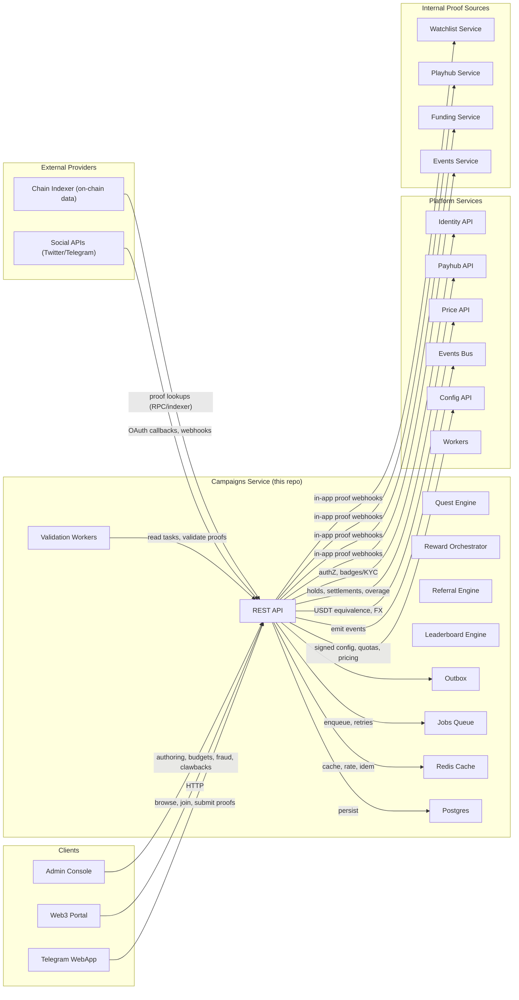
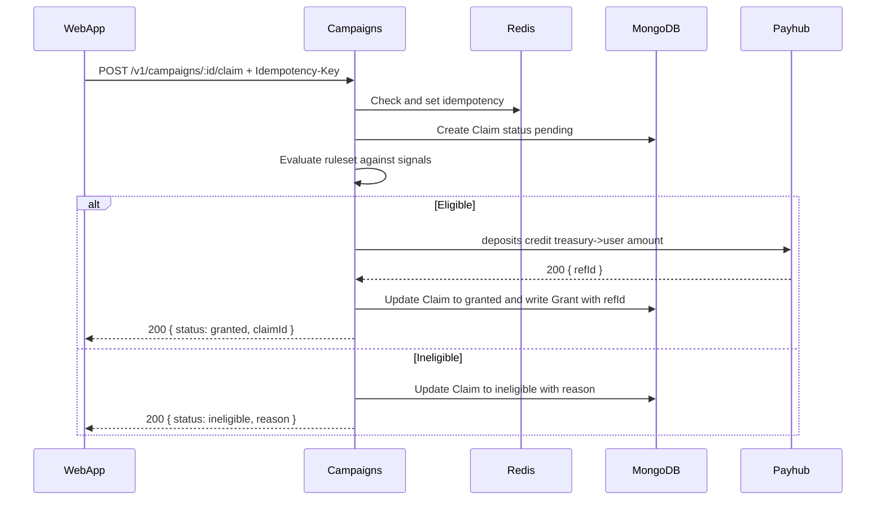

# Miniapp Campaigns Service
*Version:* v0.1.0  
*Last Updated:* 2025-09-24 01:43 +07  
*Owner:* FUZE Growth Engineering — Campaigns and Rewards

> High level architectural blueprint for the **Campaigns** service. This repo powers giveaways, airdrops, referral rewards, quests, and conditional claims for the Telegram Mini App. It interoperates with Identity, Payhub, PlayHub, Discovery, Events, Admin, Workers, Config, Infra, and Shared libraries. For MVP it issues rewards in STAR, FZ, and PT via **off chain custody** using Payhub deposit credits.

---

## 1) Architecture Diagram

*Notes:* Campaigns never mutates balances directly. It calls **Payhub** to issue credits from a **campaign treasury user** to the claimant, with strict idempotency and audit trails. All end user authentication is via **Identity** tokens.

---

## 2) Technology Stack
| Layer | Choice | Rationale |
|---|---|---|
| Runtime | Nodejs 20 plus TypeScript | Shared platform toolchain |
| Framework | Express plus Zod | Predictable validation and DTOs |
| Storage | MongoDB | Flexible campaign models and claim states |
| Cache | Redis | Idempotency, locks, rate limits |
| Auth | jose Ed25519 JWT | End user and service tokens |
| Telemetry | OpenTelemetry plus Pino | Standard tracing and logs |
| Config | tg miniapp config | Feature flags, limits, fee bps |
| Deploy | Docker plus Helm | CI and CD via infra repo |

---

## 3) Responsibilities and Scope
**Owns**
- Campaign creation, publishing, and lifecycle scheduling.  
- Eligibility evaluation from rules and external signals.  
- Claim processing with **idempotency** and anti abuse controls.  
- Reward issuance via **Payhub deposit credit** from campaign treasury to user.  
- Audit log and operator views via Admin.  

**Out of scope**
- Ledger accounting and conversions — handled by Payhub.  
- Wallet custody — handled by Payhub.  
- Deep social graph or on chain proofs — future phases.

---

## 4) Data Flows

### 4.1 Claim Processing

**Failure handling**: if Payhub call times out after credit is committed, idempotent retry returns the same receipt; if Payhub fails before commit, claim remains eligible and **Worker** retries.

### 4.2 Budget Control
- Each campaign tracks `spent = Σ granted.amount`. Attempts that would exceed `totalBudget` are rejected with `BUDGET_EXCEEDED`. Reserve windows can be implemented by locks per campaign id during bursts.

### 4.3 Referral Campaigns
- `referredNUsers` rule checks Identity referral binding; grants occur to the referrer upon referred user milestones (e.g., first matchmaking join). Workers subscribe to domain events in future phases.

---

## 5) Security and Anti Abuse
- **Auth**: Identity session tokens; admin routes require staff role.  
- **Idempotency**: Redis based with 48 h retention; `Idempotency-Key` mandatory on POST.  
- **Rate limits**: per user and per campaign caps; sliding window counters in Redis.  
- **Validation**: Zod DTOs; currency allow list and integer amounts.  
- **Fraud checks**: device and IP heuristics optional; deny lists configurable.  
- **Audit**: every admin action and grant recorded; exportable.  
- **Privacy**: store only ids and coarse attributes; no PII.  
- **Secrets**: managed via secret manager; no secrets in code or client.

---

## 6) Scalability and Reliability
- Stateless API; scale horizontally; Redis for hot paths.  
- MongoDB with compound indexes; pagination with cursors.  
- Workers for retries and DLQ; exponential backoff on Payhub.  
- SLOs: p95 < 120 ms reads, < 250 ms claim path median excluding Payhub call.  
- Health probes `/healthz` and `/readyz` validate DB, Redis, and config freshness.  
- DR: daily backups; PITR recommended.

---

## 7) Observability
- **Tracing** end to end with `requestId`, `campaignId`, `claimId`, `correlationId`.  
- **Metrics**: claims per minute, eligibility pass rate, grants per minute, error rates, Payhub latency.  
- **Logs**: structured and redacted; include user and campaign ids.  
- **Alerts**: spike in ineligible due to config, Payhub failures, budget near exhaustion.

---

## 8) User Stories and Feature List
### Feature List
- Create, publish, pause, and end campaigns.  
- Eligibility with composable rules and external signals.  
- Claim path with idempotency and anti abuse.  
- Reward issuance via Payhub deposit credit.  
- Admin audit and exports.

### User Stories
- *As a participant*, I can claim a campaign reward if I meet the rules so that I am rewarded for engagement.  
- *As a growth manager*, I can launch an airdrop with a budget and rules so that we can acquire users safely.  
- *As finance*, I can audit grants and reconcile against the ledger so that payouts are transparent.  
- *As support*, I can retry a failed claim safely without double paying.

---

## 9) Roadmap
- Event driven grants from domain events stream.  
- Signed vouchers for offline distribution with verification at claim time.  
- On chain reward mode with custody adapters.  
- Segmentation and experimentation for campaign variants.

---

## 10) Compatibility Notes
- Uses Identity for auth and referral bindings.  
- Calls Payhub deposit credit to issue rewards from campaign treasury.  
- Surfaces campaigns to WebApp and Admin; Workers handle retries and expiry.  
- Optional signals from Discovery, Events, and PlayHub for richer rules.
