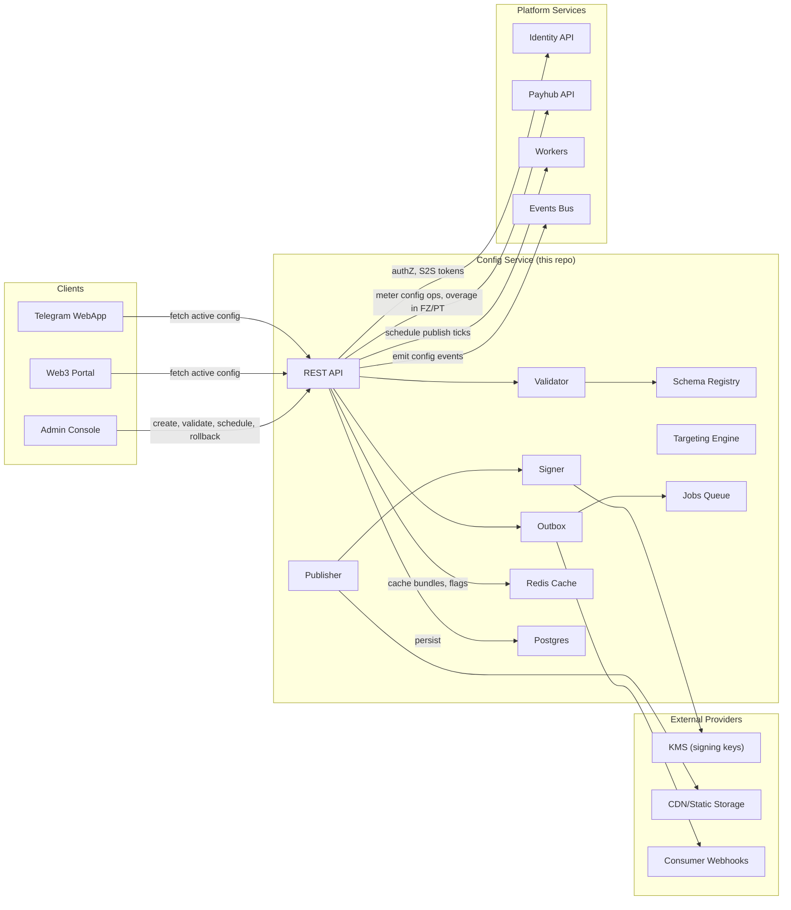
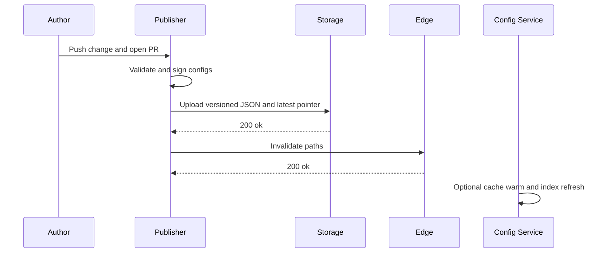
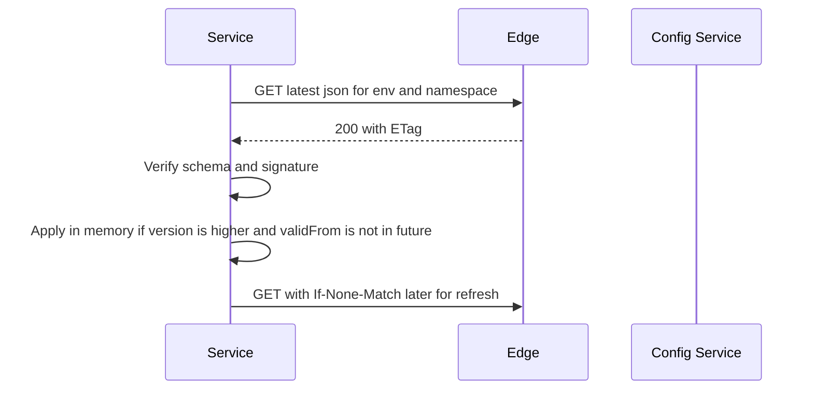

# Miniapp Config
*Version:* v0.1.0  
*Last Updated:* 2025-09-24 03:35 +07  
*Owner:* FUZE Platform Core — Configuration and Feature Flags

> High level architectural blueprint for the **Configuration Platform**. This repo delivers a small read only **Config Service** plus a **Publisher CLI and CI workflow** that validates, signs, versions, and serves JSON configs and feature flags to all other repos. No secrets are stored here. Secrets live in the cloud secret manager owned by infra.

---

## 1) Architecture Diagram (HLD)

*Notes:* **Config Service** is optional when CDN is available; services can fetch JSON from the CDN directly. The service mainly exposes an index, health, and the **signer JWKS** location. All files are **signed** so consumers verify authenticity before applying. No runtime mutations.

---

## 2) Technology Stack
| Layer | Choice | Rationale |
|---|---|---|
| Formats | JSON and YAML | Human editable and machine friendly |
| Validation | JSON Schema with Ajv | Strong schemas and error messages |
| Signing | Ed25519 via jose | Lightweight signatures and JWKS |
| Service | Node.js plus Express | Read only index and JWKS endpoint |
| Storage | GCS or S3 | Durable object storage for versioned blobs |
| CDN | Cloud CDN or CloudFront | Low latency global reads |
| CI | GitHub Actions | Lint, validate, sign, publish |
| Telemetry | OpenTelemetry plus Pino | Uniform logs and traces |

---

## 3) Responsibilities and Scope
**Owns**
- **Schemas** for shared config across repos.  
- **Manifests** per environment and namespace with Version and Created At.  
- **Publisher** that validates, signs, versions, and uploads to storage and CDN.  
- **Config Service** exposing an index, latest pointers, and JWKS for verification.  
- **Hot reload contracts** for services and webapps.

**Out of scope**
- Secrets and credentials.  
- Dynamic per user experiments beyond flag gating (future experimentation service).

---

## 4) Data Flows

### 4.1 Publish Flow

### 4.2 Consumer Hot Reload (Service)

### 4.3 WebApp Bootstrap Flags
- WebApp fetches `webapp` namespace once after login.  
- Flags persist in memory and are rechecked on app focus or pull to refresh.

---

## 5) Security and Integrity
- **No secrets**: only non sensitive configuration and flags.  
- **Signatures**: all files signed with Ed25519; consumers verify before applying.  
- **Anti rollback**: monotonic `version` plus `validFrom` check.  
- **Auth**: CDN URLs can be public read; Publisher uses CI runner with secret manager to access private keys.  
- **Key rotation**: JWKS exposes multiple keys with `kid`; Publisher signs with current key.  
- **Schema lock**: breaking schema changes require major version bump and compatibility notes.

---

## 6) Reliability and Performance
- Configs are static objects served via CDN with high cacheability.  
- Services use **ETag** and `If-None-Match` to avoid heavy pulls.  
- Fallback: if verification fails, keep the last good config and alert.  
- SLO: p95 fetch under 50 ms from edge; 99.9 percent availability from CDN.

---

## 7) Observability
- **Publisher metrics**: publish counts, validation failures, sign latency, CDN purge time.  
- **Service metrics**: config apply success rate, version age, verification errors.  
- **Logs**: structured logs with `namespace` and `version`.  
- **Alerts**: stale configs beyond threshold, repeated verification failures.

---

## 8) User Stories and Feature List
### Feature List
- Validated and signed config delivery with versioning.  
- Read only service with index and JWKS.  
- CI driven publisher with promote and diff.  
- Hot reload contracts for services and webapps.

### User Stories
- *As an operator*, I enable a feature flag for PlayHub by publishing a new version to staging and promoting to prod after verification.  
- *As a service*, I fetch the latest config, verify the signature, and update behavior without restart.  
- *As a frontend developer*, I toggle a UI experiment via the `webapp` namespace.

---

## 9) Compatibility Notes
- All services read their namespace from this platform; env var names remain the source of truth for URLs and secrets.  
- Watchlist uses `SVC_WATCHLIST_URL` naming consistently.  
- Price, PlayHub, Funding, Escrow, Campaigns, Events, Admin, WebApp, Workers integrate via the same signed config pattern.
