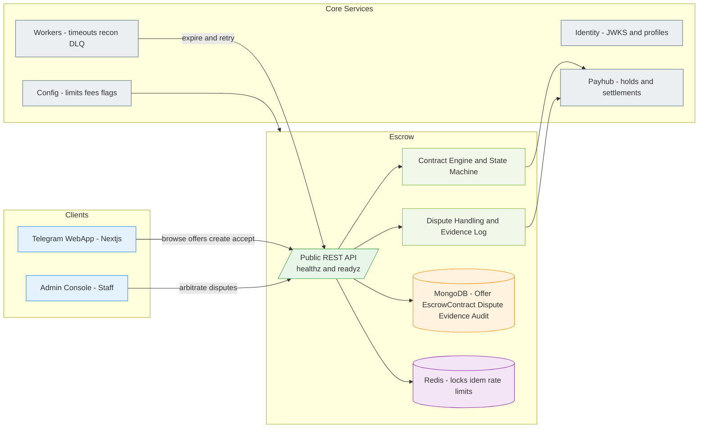
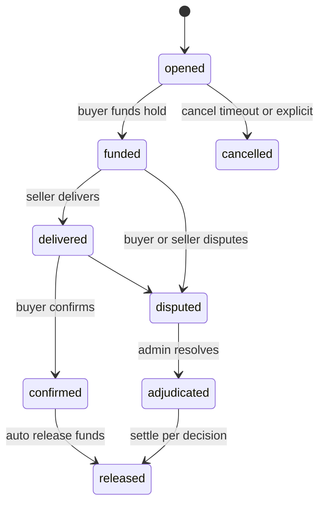
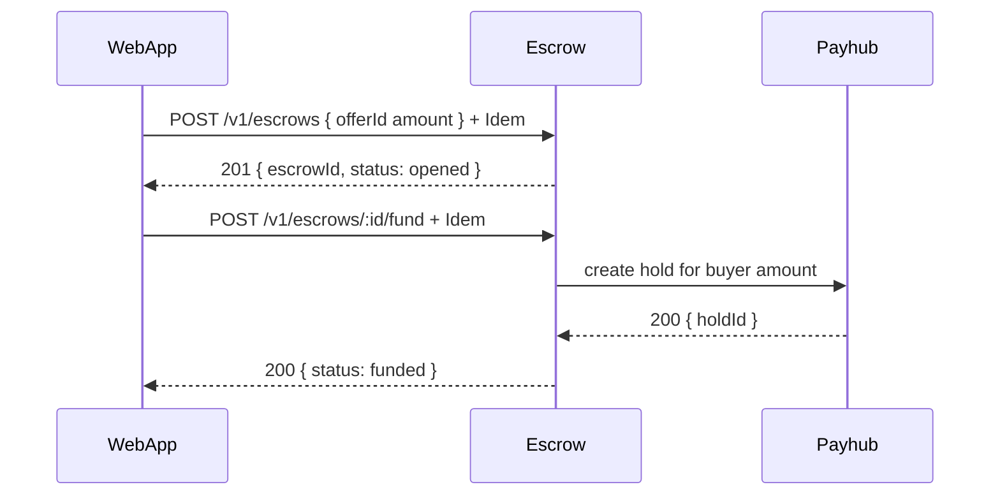
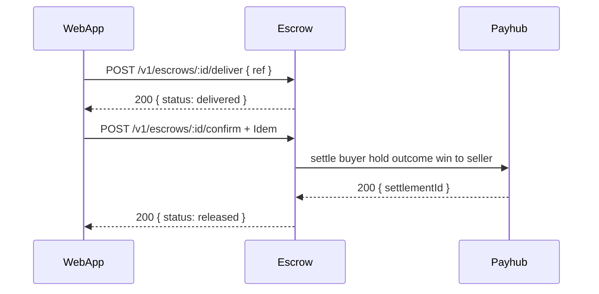
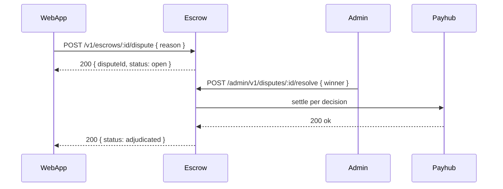

# Miniapp Escrow Service
*Version:* v0.1.0  
*Last Updated:* 2025-09-24 02:17 +07  
*Owner:* FUZE Commerce Engineering — OTC and P2P Escrow

> High‑level architectural blueprint for the **Escrow Service** providing OTC and P2P contracts that safely lock funds and release them based on conditions. Escrow uses **Payhub** holds and settlements, **Identity** for auth, **Admin** for arbitration, and **Workers** for timeouts and retries. MVP supports off chain custody for **STAR, FZ, PT, FUZE, USDT** per config.

---

## 1) Architecture Diagram

*Notes:* Escrow **never** mutates balances directly. All value movement is via Payhub: **holds** when a contract is opened and **settlements** when it is completed or adjudicated. Evidence attachments are stored via object storage in infra with signed URLs, referenced by Escrow documents.

---

## 2) Technology Stack
| Layer | Choice | Rationale |
|---|---|---|
| Runtime | Nodejs 20 plus TypeScript | Shared platform toolchain |
| Framework | Express plus Zod | Predictable schema validation |
| Storage | MongoDB | Flexible models for contracts and disputes |
| Cache | Redis | Idempotency, locks, rate limits, expirations |
| Auth | jose Ed25519 JWT | Identity verified sessions and service JWTs |
| Telemetry | OpenTelemetry plus Pino | Standard tracing and logs |
| Config | tg miniapp config | Limits, fees, feature flags |
| Deploy | Docker plus Helm | Same CI and CD as other services |

---

## 3) Responsibilities and Scope
**Owns**
- **Offers**: create and list OTC offers for assets priced in STAR FZ PT etc.  
- **Contracts**: open, fund, deliver, confirm, release, or cancel with a strict state machine.  
- **Disputes**: raise, submit evidence, and resolve via staff arbitration.  
- **Timeouts**: automatic expiry and refunds when the counterparty fails to act.  
- **Audit**: complete audit trail with correlation ids and immutable events.

**Out of scope**
- On chain settlement and custody (future adapters).  
- Messaging beyond minimal notes; rich chat is out of scope.  
- Price discovery or matching engine.

---

## 4) State Machine and Flows

### 4.1 Contract State Machine

**Settlement rules**  
- **confirmed**: buyer hold settles `win` to seller; optional seller bond `win` back to seller.  
- **cancelled**: release any buyer hold; seller bond, if present, `win` back to seller.  
- **adjudicated**: admin selects winner; buyer hold settles to winner, bond settles accordingly.

### 4.2 Funding and Release Flow

### 4.3 Delivery and Confirmation

### 4.4 Dispute and Arbitration

---

## 5) Security and Compliance
- **Auth**: Identity session tokens for users; service JWTs for internal calls.  
- **Idempotency**: all POST routes require `Idempotency-Key`.  
- **Rate limits**: per user for open, fund, deliver; Redis counters.  
- **Validation**: Zod DTOs; integer amounts; currency allow‑list.  
- **Evidence safety**: pre‑signed URLs, content type checks, size limits, malware scan in Workers.  
- **Audit**: every transition is emitted as an `AuditEvent`.  
- **Privacy**: store only ids; no PII.  
- **Secrets**: secret manager; rotate keys.  
- **Abuse**: deny self‑dealing; blacklist repeated abusers; optional seller bond config.

---

## 6) Scalability and Reliability
- Stateless API with Redis for locks and TTLs; horizontal scale.  
- MongoDB with compound indexes for inbox‑style queries.  
- Workers execute expiries and DLQ replays with exponential backoff.  
- SLOs: p95 < 150 ms for reads and simple mutations.  
- Health checks `/healthz` and `/readyz` validate DB, Redis, and config freshness.  
- DR: backups; PITR recommended.

---

## 7) Observability
- **Tracing** with `requestId`, `escrowId`, `offerId`.  
- **Metrics**: contracts opened per hour, funded rate, release time, dispute rate, admin decisions, Payhub latency.  
- **Logs**: structured redacted logs; evidence URLs never logged.  
- **Alerts**: spike in disputes, settlement failures, backlog growth in expiries.

---

## 8) User Stories and Feature List
### Feature List
- Offers marketplace and direct contracts.  
- Contract state machine with holds and settlements.  
- Dispute and arbitration workflow.  
- Expiry and refund automation.  
- Full audit and metrics.

### User Stories
- *As a seller*, I can list an offer with clear terms so that buyers can open a safe escrow.  
- *As a buyer*, I can fund an escrow and confirm delivery, knowing funds are locked until I receive the item.  
- *As staff*, I can resolve disputes and ensure fair settlements.  
- *As finance*, I can audit escrows and reconcile settlements in Payhub.

---

## 9) Roadmap
- Reputation and limits based on history.  
- Multi item deliveries and milestones.  
- On chain settlement adapter.  
- Messaging integration and richer evidence types.

---

## 10) Compatibility Notes
- Relies on Identity for user auth and roles.  
- Uses Payhub for all value operations.  
- Surfaces flows to WebApp and Admin; Workers handle expiries and retries.  
- DTOs via `tg miniapp shared`; config via `tg miniapp config`.
