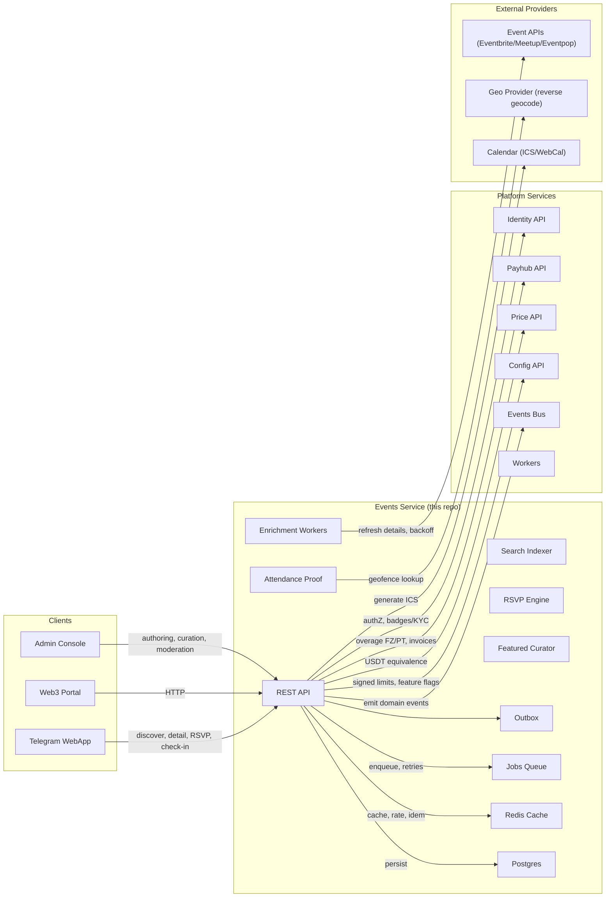
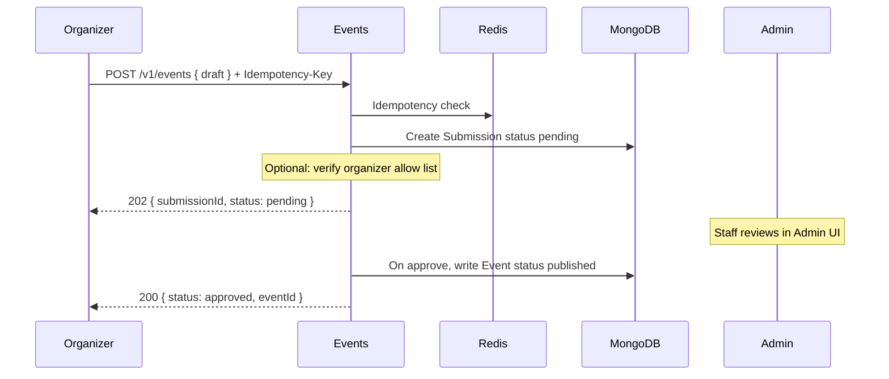

# Miniapp Event Service
*Version:* v0.1.0  
*Last Updated:* 2025-09-24 02:06 +07  
*Owner:* FUZE Community & Ecosystem Engineering — Events

> High‑level architectural blueprint for the **Events Directory**. This service lets organizers publish events that **deep link** to external booking platforms (Luma, Eventbrite, Eventpop, Meetup, etc.). The platform stores only **basic metadata** (title, image, description, location, dates, host, place name, conditions) and exposes read APIs for the WebApp, plus submission and moderation APIs for organizers and staff. No ticketing or payment is handled here.

---

## 1) Architecture Diagram

*Notes:* The Events service is **read‑heavy** and safe by design: no ticketing, no wallet custody. It stores links to external platforms and renders a canonical event page/card in the WebApp with a **Book on ...** button that opens the external URL.

---

## 2) Technology Stack
| Layer | Choice | Rationale |
|---|---|---|
| Runtime | Nodejs 20 plus TypeScript | Shared platform toolchain |
| Framework | Express plus Zod | Predictable schema validation |
| Storage | MongoDB | Flexible documents for events and submissions |
| Cache | Redis | Response cache, rate limits, idempotency |
| Auth | jose Ed25519 JWT | Identity‑verified sessions and staff roles |
| Telemetry | OpenTelemetry plus Pino | Standard tracing and logs |
| Config | tg miniapp config | Feature flags and allow lists |
| Deploy | Docker plus Helm | Same CI and CD as other services |

---

## 3) Responsibilities and Scope
**Owns**
- Public **events directory** with search and filters.  
- Organizer **submission** flow and **moderation** workflow.  
- Event **canonical cards** and metadata, plus optional ICS generation.  
- Cross‑links to **Watchlist** by asset tags (e.g., BTC meetup).  
- Caching and RSS/JSON feed exports for partner embeds.

**Out of scope**
- Ticket sales, payments, or on‑site check‑in.  
- User attendance tracking beyond simple clickthroughs.  
- Heavy social features; kept minimal in MVP.

---

## 4) Data Flows

### 4.1 Organizer Submission and Moderation

### 4.2 Browse and Clickthrough
- WebApp calls `GET /v1/events` with filters → receives list. Selecting an item calls `GET /v1/events/:id` and renders an **Open external link** button. A click records a metric and opens `externalUrl` in the Telegram webview.

### 4.3 Expiry and Archival
- Worker scans `Event` where `endAt < now` → sets `status = archived` and removes from hot caches.

---

## 5) Security and Privacy
- **Auth**: reads are public; writes require Identity session and either organizer role or allow list.  
- **Idempotency**: submissions require `Idempotency-Key`; Redis stores keys for 48 h.  
- **Input validation**: Zod schemas; sanitize rich text; block dangerous HTML.  
- **Rate limits**: per organizer submission; per IP for reads; Redis counters.  
- **Link safety**: validate `externalUrl` against approved domains; use redirect service to avoid referer leakage if needed.  
- **Moderation**: staff approval required before publish; full audit logs.  
- **Privacy**: no sensitive PII; store organizer contact as opaque string if needed.  
- **Secrets**: stored in secret manager; no secrets in client or repo.

---

## 6) Scalability and Reliability
- Stateless API; horizontal scale; Redis for caching hot queries.  
- MongoDB with compound indexes; pagination via cursor.  
- Workers for oEmbed fetch and expiry cleanups; DLQ with backoff.  
- SLOs: p95 < 120 ms reads under cache hit; 99.9 percent availability.  
- Health checks `/healthz` and `/readyz` verify DB, Redis, and config freshness.  
- DR: daily backups; PITR recommended.

---

## 7) Observability
- **Tracing** with `requestId`, `eventId`, `submissionId`.  
- **Metrics**: views, clicks, submission volumes, approval rates, cache hit ratio.  
- **Logs**: structured and redacted; audit all admin actions.  
- **Alerts**: surge in rejects, oEmbed failures, cache miss spikes.

---

## 8) User Stories and Feature List
### Feature List
- Public events browse and search.  
- Organizer submissions with moderation.  
- Event detail page with clickthrough to external booking.  
- ICS generation and simple metrics.  
- Admin curation and exports.

### User Stories
- *As an attendee*, I can browse upcoming events and open the booking page.  
- *As an organizer*, I can submit an event with image, details, location, dates, and link to my ticketing page.  
- *As a moderator*, I can approve or reject events and keep the catalog clean.  
- *As a partner*, I can embed a filtered events feed on my site.

---

## 9) Roadmap
- Organizer verification flow and badges.  
- iCal subscriptions per filter.  
- Geo search and map view.  
- Event series and recurrence models.  
- Domain events to drive Campaigns or PlayHub promotions.

---

## 10) Compatibility Notes
- Works with Identity tokens and roles for organizers and staff.  
- Provides events to WebApp and Admin; Workers handle scraping and expiry.  
- Optionally enriches with Watchlist asset tags for crypto specific events.  
- No interactions with Payhub or settlement systems.
