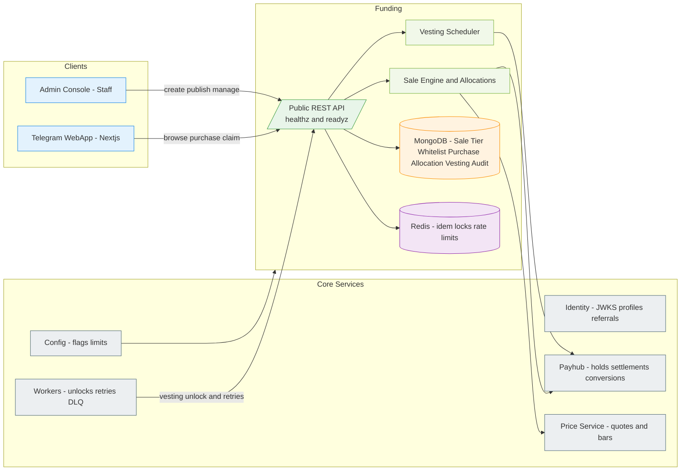
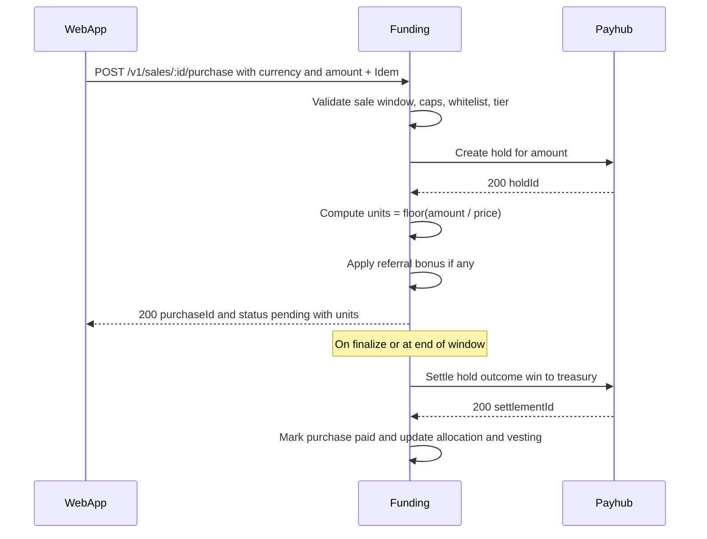
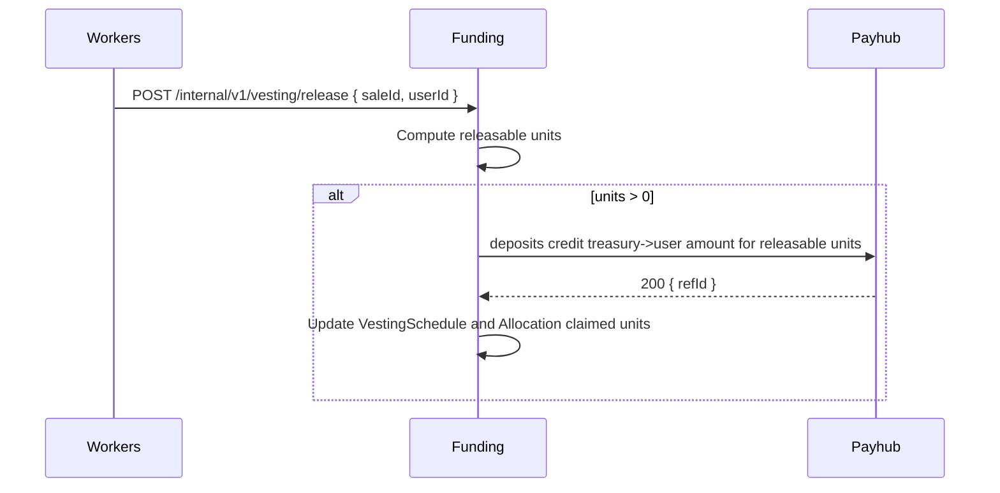

# Miniapp-Funding-Service
*Version:* v0.1.0  
*Last Updated:* 2025-09-24 02:22 +07  
*Owner:* FUZE Capital Formation Engineering — Funding

> High‑level architectural blueprint for the **Funding Service** powering private sales, IDO style allocations, and presales within the Telegram Mini App. MVP operates with **off chain custody** using STAR, FZ, PT, FUZE, USDT via Payhub. It manages sale definitions, whitelists, purchase flows, referral benefits, allocations, and vesting schedules. No direct ledger mutations — all value changes go through **Payhub**. Identity provides auth and referral binding. Admin governs listings and audits. Workers handle vesting unlocks and retries.

---

## 1) Architecture Diagram

*Notes:* Funding owns sale metadata and allocation math. Purchases place **holds** or perform **deposit credits** via Payhub depending on flow. Vesting creates scheduled **grants** and releases as credits over time. Identity referral codes can apply bonus allocations or whitelist priority per config.

---

## 2) Technology Stack
| Layer | Choice | Rationale |
|---|---|---|
| Runtime | Nodejs 20 plus TypeScript | Shared stack |
| Framework | Express plus Zod | Predictable DTO validation |
| Storage | MongoDB | Flexible sale and vesting models |
| Cache | Redis | Idempotency, locks, rate limits, schedules |
| Auth | jose Ed25519 JWT | End user sessions and service JWTs |
| Telemetry | OpenTelemetry plus Pino | Standard tracing and logs |
| Config | tg miniapp config | Fee bps, caps, asset allow list |
| Deploy | Docker plus Helm | Same CI and CD as other services |

---

## 3) Responsibilities and Scope
**Owns**
- **Sales**: define offerings, tiers, price schedules, per user caps, and whitelists.  
- **Purchases**: secure purchase path with idempotency and optional conversion quotes.  
- **Allocations**: compute purchased allocation amounts and referral bonuses.  
- **Vesting**: schedule releases with cliffs and linear unlocks; mint credits on schedule.  
- **Claims**: expose read‑only allocation and vesting status to users and Admin.  
- **Audit**: immutable audit trail for purchases and unlocks.

**Out of scope**
- On chain token distribution in MVP (planned adapter).  
- KYC collection and storage — integrate with external provider if required, store provider reference only.  
- Public price discovery; relies on **Price Service** or fixed price per tier.

---

## 4) Data Flows

### 4.1 Purchase Flow (hold then capture)

### 4.2 Vesting Release

### 4.3 Refunds
- If a purchase is refundable (policy or failure), Admin triggers refund: Funding settles hold with `loss` or issues a negative credit by agreement; updates Allocation accordingly. All refunds audited.

---

## 5) Rules and Calculations

- **Price**: `units = floor(amountPaid / pricePerUnit)` using integer math.  
- **Referral bonus**: `bonusUnits = floor(units * referralBonusBps / 10000)` if parent exists.  
- **Caps**: enforce `perUserCap` and `hardCap`; holds rejected once caps would be exceeded.  
- **Vesting**:  
  - *cliff*: all unlocked at `cliffAt`.  
  - *linear*: unlock `rate = totalUnits / (endAt - startAt)`; release in discrete steps.  
  - *cliff_linear*: release `X%` at cliff then linear thereafter.  
- **Rounding**: deterministic rounding down; remainders accumulate and release on final epoch.  
- **Currencies**: allowed by config; conversion path uses Payhub conversions and Price snapshots for quotes.

---

## 6) Security and Compliance
- **Auth**: Identity session tokens for users; service JWTs for internal calls.  
- **Idempotency**: required for all POSTs; Redis backed keys retained 48 h.  
- **Rate limits**: per user purchase rate and per sale caps; Redis counters.  
- **Validation**: Zod DTOs; integer amounts; asset and currency allow‑lists.  
- **Audit**: every sale state change, purchase, and vesting release logged.  
- **KYC**: optional external integration — store only `providerRef` and decision, never raw documents.  
- **Secrets**: managed via secret manager; no secrets in client or repo.  
- **Abuse**: deny lists and bot heuristics; referral self‑dealing prevented (`userId != parentId`).  
- **Legal**: display disclaimers per jurisdiction and restrict countries via allow lists if configured.

---

## 7) Scalability and Reliability
- Stateless API; horizontal scale; Redis for hot paths and schedules.  
- MongoDB with compound indexes for sales and purchases.  
- Workers handle vesting releases and retries with backoff.  
- SLOs: p95 < 150 ms on reads and < 300 ms on purchase mutations.  
- Health checks `/healthz` and `/readyz` include DB, Redis, and config freshness.  
- DR: backups; PITR recommended.

---

## 8) Observability
- **Tracing**: propagate `requestId`, `saleId`, `purchaseId`, `vestingId`.  
- **Metrics**: purchases per minute, conversion latency, unlock throughput, refund rate.  
- **Logs**: structured redacted logs; no sensitive PII.  
- **Alerts**: cap near exhaustion, settlement failures, vesting backlog spike.

---

## 9) User Stories and Feature List
### Feature List
- Sales and tier definitions with caps and whitelists.  
- Purchases with holds and conversions.  
- Allocation and referral bonuses.  
- Vesting schedules and automated releases.  
- Admin dashboards and exports.

### User Stories
- *As a participant*, I can purchase a presale allocation using USDT or platform currencies and see my vesting.  
- *As a project owner*, I can configure a sale with tiers and caps and monitor purchases.  
- *As a referrer*, I receive bonus allocation based on my referees purchases.  
- *As finance*, I can audit allocations and releases with clear receipts.

---

## 10) Roadmap
- On chain distribution adapter with Merkle claims or direct transfers.  
- Dynamic pricing tiers and oversubscription handling.  
- KYC gating and jurisdiction restrictions.  
- Secondary transfer of allocations within policy.

---

## 11) Compatibility Notes
- Works with Identity for auth and referrals.  
- Uses Payhub for all value operations and optional conversions.  
- Uses Price snapshots when needed.  
- Surfaces flows to WebApp and Admin; Workers run unlocks and retries.
