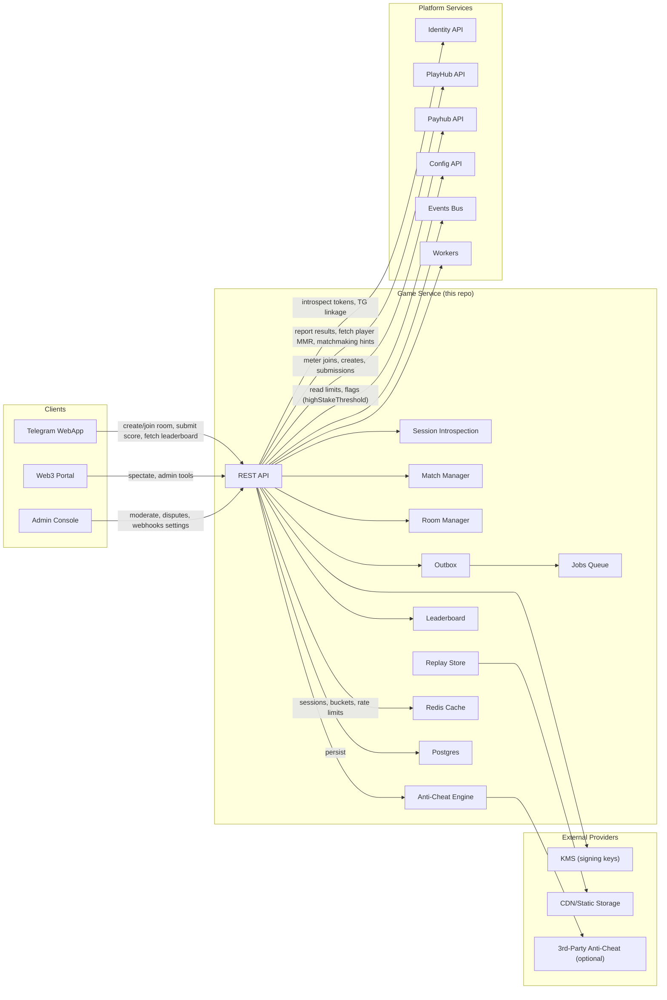
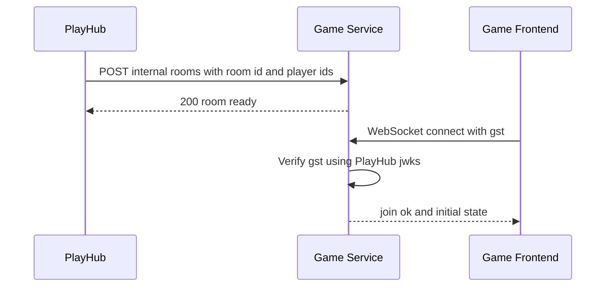
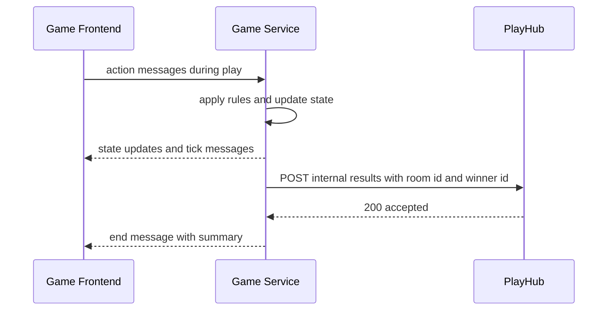
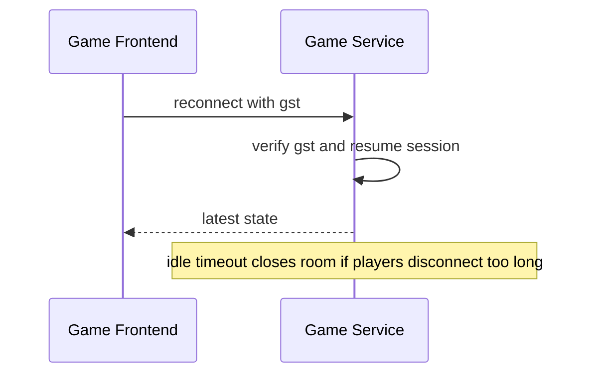

# Miniapp Game Service Template
*Version:* v0.1.0  
*Last Updated:* 2025-09-24 03:57 +07  
*Owner:* FUZE Games Platform — Partner Game Blueprint

> High‑level architectural blueprint for a **partner game backend template** that plugs into **PlayHub**. The template shows how to implement server authoritative gameplay, secure room creation, **GST** verification, real‑time transport, result reporting, observability, and ops. It is intentionally minimal so that different games can fork it and add game logic while keeping a consistent contract with PlayHub.

---

## 1) Architecture Diagram (HLD)

*Notes:* Game Service trusts **PlayHub** to mint **GST** tokens. The game verifies GST using PlayHub **JWKS** and never touches balances or Payhub. All financial settlement is done by PlayHub after receiving the result from the game server.

---

## 2) Technology Stack
| Layer | Choice | Rationale |
|---|---|---|
| Runtime | Node.js 20 and TypeScript | Consistent with other repos |
| HTTP | Express and Zod | Small surface, strict DTOs |
| Realtime | ws or uWebSockets.js | Lightweight WebSocket server |
| Auth | jose Ed25519 verify | Validate **GST** against PlayHub JWKS |
| Storage | Redis and MongoDB | Fast room registry and durable audit |
| Telemetry | OpenTelemetry and Pino | Tracing and structured logs |
| Deploy | Docker and Helm | Runs in platform Kubernetes |

---

## 3) Responsibilities and Scope
**Owns**
- **Room lifecycle** after PlayHub requests creation.  
- **Realtime gameplay** with server authoritative rules.  
- **Result computation** and **server to server** result callback to PlayHub.  
- **Fairness**: deterministic simulation, turn timers, anti replay and anti flood.  
- **Observability**: metrics, logs, traces; operator endpoints.

**Out of scope**
- Wallet or settlement logic; no Payhub calls.  
- User auth beyond verifying **GST**.  
- Price oracles or non game data.

---

## 4) Flows

### 4.1 Room Create and Join

### 4.2 Gameplay and Result

### 4.3 Reconnect and Timeout

---

## 5) Game Rules Engine
- **Deterministic**: seed derived from room id and optional salt, so the same inputs produce the same outputs.  
- **Authoritative**: server validates all actions; clients are dumb renderers.  
- **Timers**: per turn timeout and total match timeout; defaults set in config.  
- **Cheat resistance**: rate limit actions per user; ignore out of turn moves; reject invalid sequences.  
- **Idempotency**: define `version` and accept only actions against the latest or next version.  
- **Replay**: keep compact replay log for disputes; include checksum in result callback.

---

## 6) Security
- **GST verification**: fetch PlayHub JWKS and cache with expiry; validate `aud` and `iss`, check `roomId` and `gameId` claims.  
- **Allow lists**: accept internal calls only from PlayHub via service JWT and network policy.  
- **Transport**: TLS only; WebSocket upgrades behind ingress with sticky sessions optional.  
- **Secrets**: no private keys; only JWKS for verify.  
- **Input validation**: Zod schemas for internal routes and WebSocket messages.  
- **Rate limits**: per ip and per user on connect and actions; Redis counters.  
- **Audit**: record room create, connect, disconnect, result send.

---

## 7) Reliability and Performance
- Stateless API and WS gateway; room state pinned in Redis and periodic MongoDB checkpoints.  
- Horizontal scale by adding pods; use consistent hashing on `roomId` for sharding if needed.  
- Backpressure and flood control on each connection.  
- Health probes `/healthz` and `/readyz` include Redis and JWKS freshness.  
- SLOs: p95 under 120 ms for state messages; handle thousands of concurrent rooms with modest hardware.

---

## 8) Observability
- **Tracing**: spans for room create, connect, action handle, result post.  
- **Metrics**: rooms live, actions per second, reconnect rate, dropped messages, time to result.  
- **Logs**: structured logs with `roomId`, `userId`, `requestId`; no gst contents.  
- **Alerts**: spike in dropped messages, result callback failures, Redis latency.

---

## 9) User Stories and Feature List
### Feature List
- Internal room creation.  
- WebSocket gameplay with GST verification.  
- Server authoritative rules and deterministic state.  
- Result callback to PlayHub.  
- Reconnect and timeouts.  
- Metrics and audits.

### User Stories
- *As PlayHub*, I can create a room and rely on the game to accept GST based connections and run the match.  
- *As a player*, I can reconnect after a short network loss and continue the match.  
- *As ops*, I can see room and action metrics and investigate disputes using audits.

---

## 10) Compatibility Notes
- Works with **PlayHub** GST and internal contracts.  
- Does not integrate with **Payhub** directly.  
- Uses shared DTOs from **tg-miniapp-shared** for room and result messages.  
- Deploys on the same infra and follows the same observability stack.
