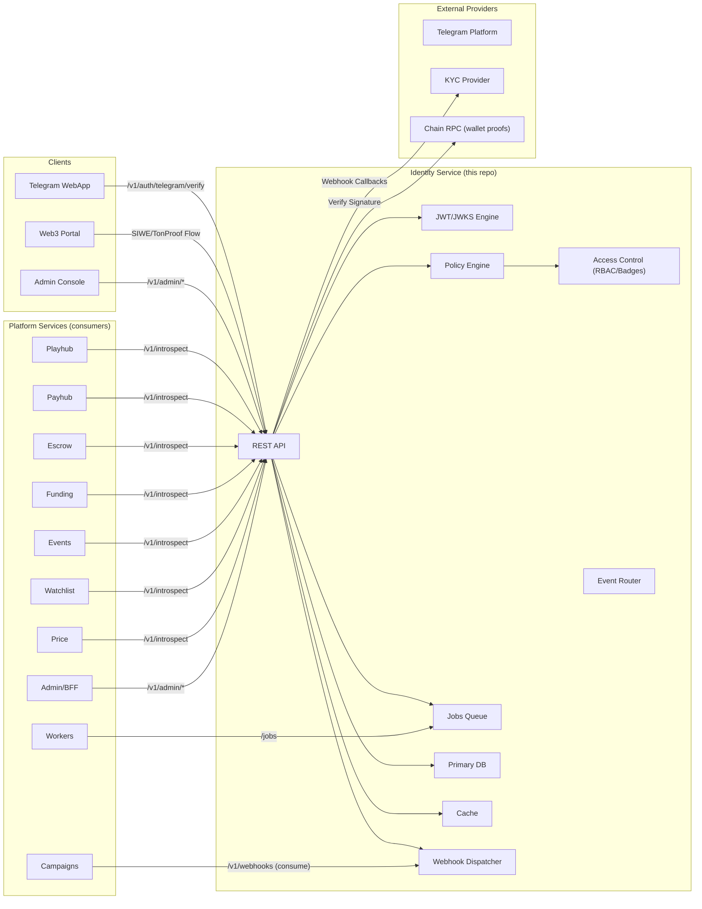
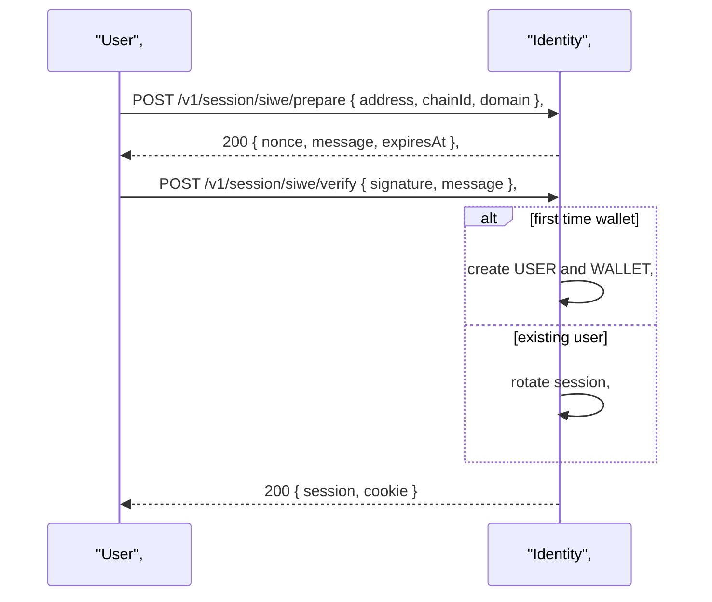
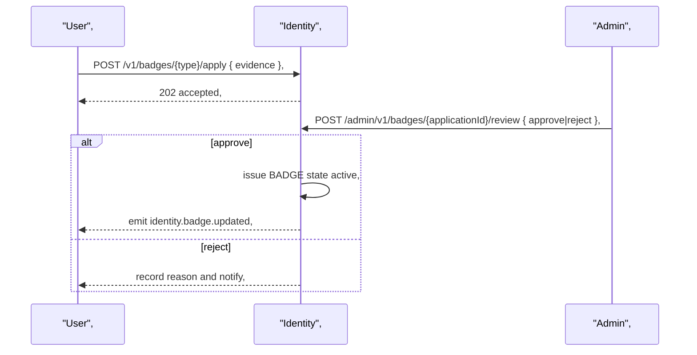
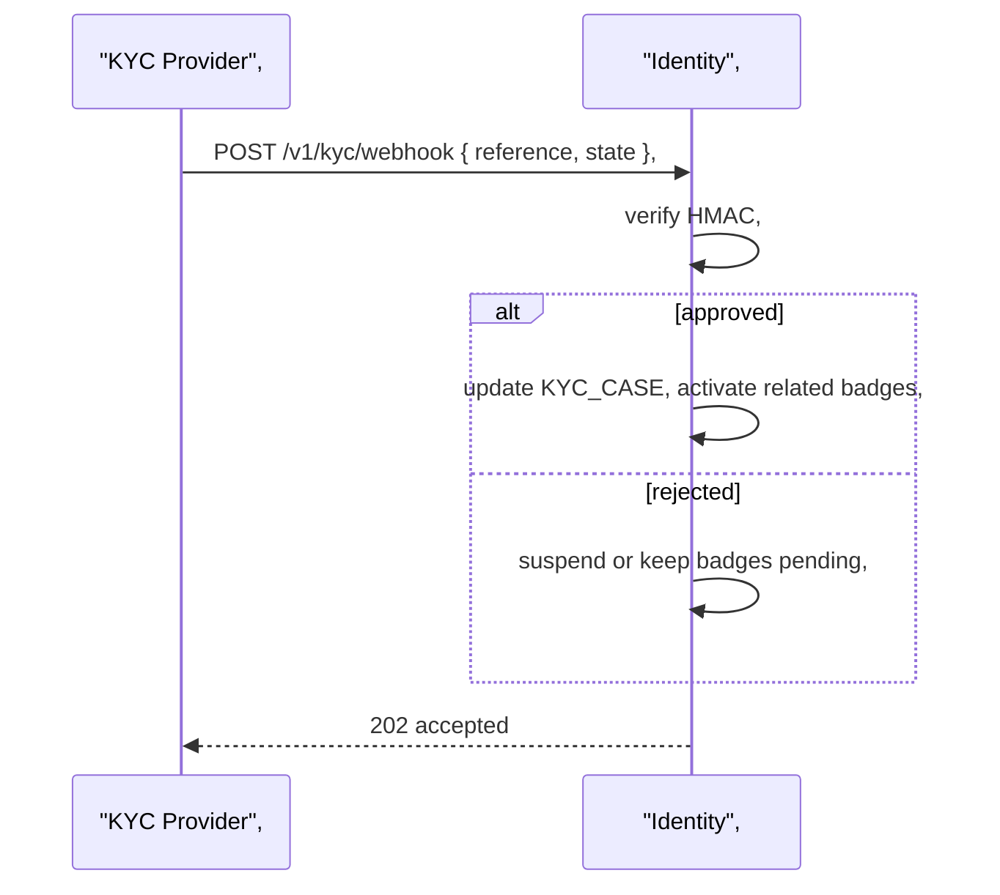
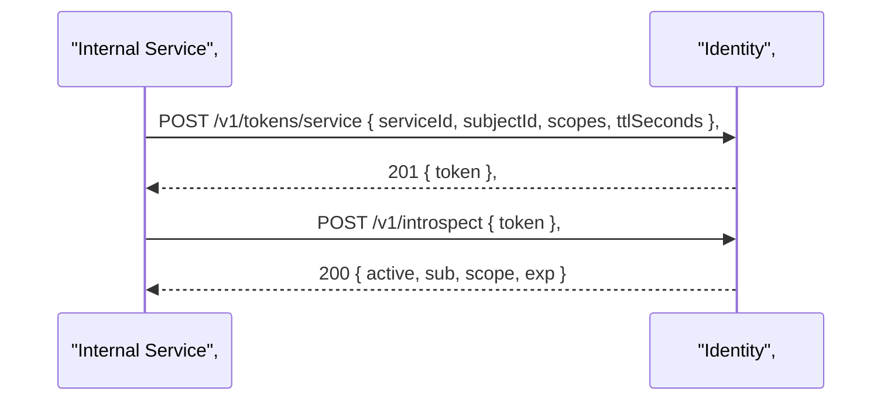

# Miniapp Identity Service
*Version:* v0.1.0  
*Last Updated:* 2025-09-24 02:46 +07  
*Owner:* FUZE Platform Identity — Auth, Profiles, Referrals

> High‑level architectural blueprint for the **Identity Service**. It authenticates Telegram users, issues short‑lived **session JWTs** for the WebApp, exposes **JWKS** for verification by services, manages **profiles, roles, referrals, language and area**, and provides **service JWTs** for trusted backends. It does **not** touch balances or ledgers.

---

## 1) Architecture Diagram

*Notes:* Identity verifies Telegram **initData** server side, issues a session token for the WebApp, and exposes **JWKS** so other services can verify that token without calling back. Services use **service JWTs** for internal calls.

---

## 2) Technology Stack
| Layer | Choice | Rationale |
|---|---|---|
| Runtime | Nodejs 20 plus TypeScript | Shared stack across repos |
| Framework | Express plus Zod | Schema validation and small footprint |
| Storage | MongoDB | Flexible user and session documents |
| Cache | Redis | Session cache, rate limits, idempotency |
| Auth | jose Ed25519 JWT | Fast verification and compact keys |
| Telemetry | OpenTelemetry plus Pino | Tracing and structured logs |
| Deploy | Docker plus Helm | Standard CI and CD |

---

## 3) Responsibilities and Scope
**Owns**
- **Telegram login**: verify initData HMAC, create or update user, issue session JWT.  
- **Profiles**: username, language, coarse area, preferences.  
- **Roles**: user, staff, organizer, partner; entitlements for Admin.  
- **Referrals**: bind parent child relationships and track attribution.  
- **JWKS**: publish public keys for session verification; rotate keys.  
- **Service tokens**: mint and rotate service JWTs for trusted backends.  
- **Rate limits**: protect login and referral endpoints.  
- **Audit**: record auth events and role grants.

**Out of scope**
- Wallets, balances, or settlements — handled by Payhub.  
- Business logic such as games or campaigns — delegated to domain services.

---

## 4) Data Flows

### A) SIWE login and wallet link

### B) Badge application and admin review

### C) KYC provider callback

### D) Service token mint and introspect

---

## 5) Security and Privacy
- **Token model**: short lived session JWT such as 15 minutes, renewable via refresh route or silent reauth using Telegram if needed.  
- **Signing**: Ed25519 keys rotated regularly; JWKS exposes public keys with `kid`.  
- **Session binding**: store `uaHash` and `ipHash` as hints to flag anomalies.  
- **Rate limits**: login and referral bind limited per user and IP.  
- **Input validation**: Zod schemas; strict TTL on Telegram initData per Telegram docs.  
- **Least PII**: store only Telegram id and coarse area; avoid sensitive data.  
- **Secrets**: bot token and signing keys stored in secret manager; not in repo.  
- **Audit**: every role grant and session revoke recorded.  
- **CORS**: restrict origins to Telegram WebApp domain and Admin origin.  
- **CSRF**: not applicable for pure token header auth; still use SameSite cookies if any.

---

## 6) Scalability and Reliability
- Stateless API with Redis for session cache and rate limits; horizontal scale.  
- MongoDB with indexes for user and session lookups.  
- Health probes `/healthz` and `/readyz` include DB, Redis, key freshness.  
- SLOs: p95 < 80 ms for login after cache warm; 99.95 percent availability.  
- DR: daily backups; consider PITR; runbook for emergency key rotation.

---

## 7) Observability
- **Tracing**: propagate `requestId`; spans for login, referral bind, and JWKS fetch.  
- **Metrics**: login success rate, referral bind rate, token verification failures.  
- **Logs**: structured logs without raw initData; include user id and request id.  
- **Alerts**: spike in failed HMAC verify, abnormal login rate, JWKS staleness.

---

## 8) User Stories and Feature List
### Feature List
- Telegram login and session issuance.  
- Profiles, preferences, and coarse area.  
- Referrals and binding with anti self‑deal checks.  
- Roles and entitlements for Admin.  
- JWKS and service token minting.

### User Stories
- *As a new user*, I log in via Telegram and receive a session token so that I can use the app securely.  
- *As a referrer*, I share my referral code so that new users bind to me automatically.  
- *As staff*, I grant the organizer role to a partner so that they can submit events.  
- *As a backend service*, I verify session tokens using JWKS without extra network calls.

---

## 9) Roadmap
- Device binding and risk scoring on login.  
- WebAuthn step up for staff accounts.  
- Phone verification via Telegram or SMS if needed.  
- Domain events stream for user lifecycle.

---

## 10) Compatibility Notes
- WebApp consumes login and profile endpoints.  
- All domain services verify session JWTs via **JWKS**.  
- Admin relies on roles from Identity.  
- No direct calls to Payhub; identity id is the key for ledgers across services.
