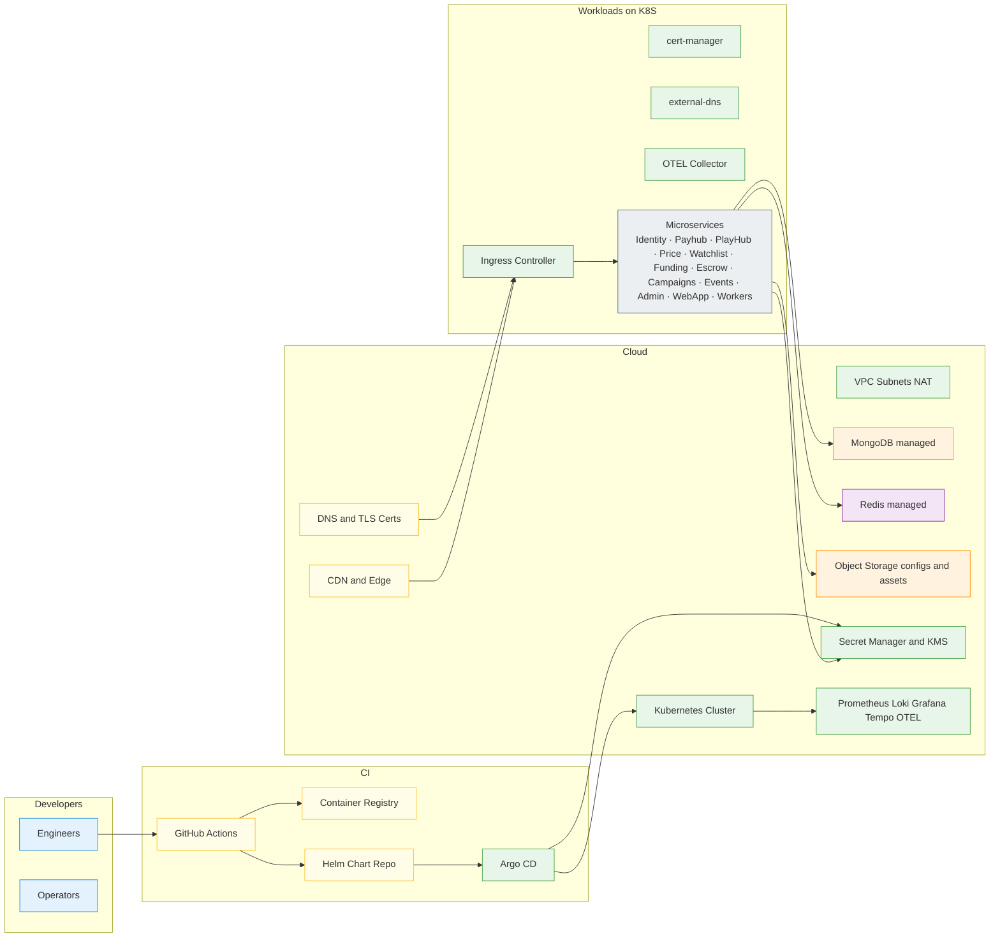
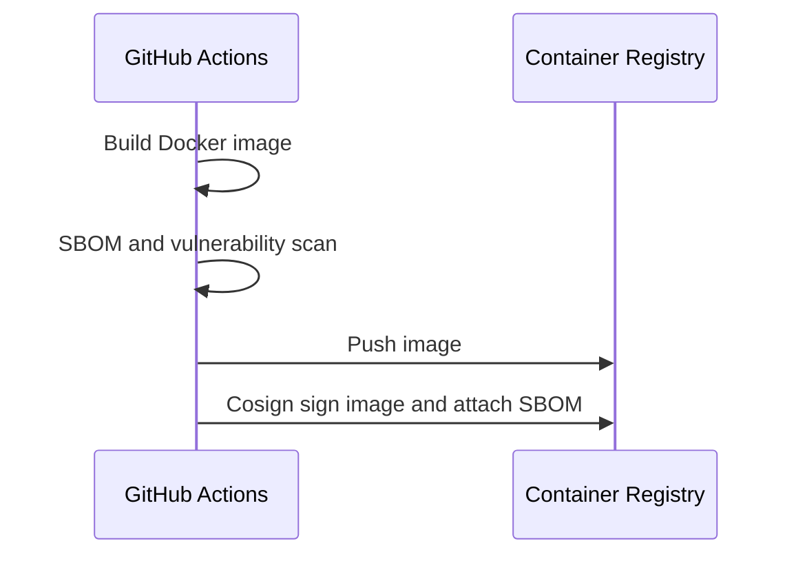
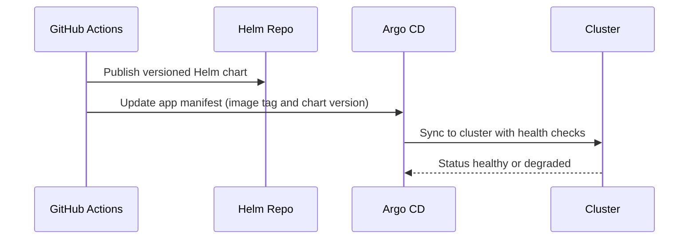

# Miniapp Infra
*Version:* v0.1.1  
*Last Updated:* 2025-09-24 03:53 +07  
*Owner:* FUZE Platform Infra — Cloud, Kubernetes, Networking, CI/CD, Observability

> High‑level architectural blueprint for the **Infrastructure Platform** that hosts all Mini App services. It defines cloud resources, Kubernetes clusters and add‑ons, CI/CD pipelines, secret management, networking, observability, backups, and DR. This repo owns **Infrastructure as Code** (Terraform) and **Helm/ArgoCD** deployment definitions.

---

## 1) Architecture Diagram (HLD)

*Notes:* Cloud provider can be **GCP** or **AWS**; modules are cloud‑agnostic where possible. Managed MongoDB and Redis are recommended (Atlas/MemoryDB/Elasticache/Cloud Memorystore).

---

## 2) Technology Stack
| Area | Choice | Rationale |
|---|---|---|
| IaC | Terraform | Declarative, modular infra |
| K8s | GKE/EKS + Helm + Argo CD | GitOps, progressive delivery |
| Ingress | NGINX Ingress or Traefik | Simplicity; managed certs via cert‑manager |
| TLS | cert‑manager + ACME | Auto renew and mTLS support (optional) |
| DNS | external‑dns | Auto DNS record management |
| Registry | GHCR or Artifact Registry/ECR | Proven, secure |
| Observability | Prometheus, Alertmanager, Grafana, Loki, Tempo, OTEL Collector | Full stack telemetry |
| Secrets | Secret Manager + KMS | Centralized secrets, envelope encryption |
| CI | GitHub Actions | Familiar, reproducible |
| CD | Argo CD | GitOps; diff & drift detection |
| Security | OPA Gatekeeper, NetworkPolicies, ImageScan + Cosign | Policy guardrails + signed images |
| Backup | Velero + provider snapshots | Cluster and DB backups |

---

## 3) Responsibilities and Scope
**Owns**
- Cloud accounts, VPCs, subnets, NAT, IAM, gateways, firewall.  
- Kubernetes cluster(s), node pools, namespaces, RBAC, add‑ons.  
- Managed services (MongoDB, Redis), object storage buckets, CDN, DNS, TLS.  
- CI/CD pipelines, secret management, image signing, SBOM and scan gates.  
- Observability stack and alerting.  
- Backups, disaster recovery plans, runbooks.

**Out of scope**
- Business logic of services (implemented in app repos).  
- Data modeling choices (owned by services).

---

## 4) Environments & Naming
- **dev**, **staging**, **prod** with separate projects/accounts.  
- Resource naming: `{env}-miniapp-{service}` (e.g., `prod-miniapp-playhub`).  
- K8s namespaces: `identity`, `payhub`, `playhub`, `price`, `watchlist`, `funding`, `escrow`, `campaigns`, `events`, `admin`, `webapp`, `workers`, plus `platform` (shared add‑ons).  
- Domains: `*.dev.example.com`, `*.stg.example.com`, `*.app.example.com` with wildcard certs.  
- Least‑privilege IAM roles per environment.

---

## 5) Network & Security Topology
- Private subnets for nodes; public subnets only for load balancers/ingress.  
- **NetworkPolicies** default deny between namespaces; allow explicit S2S paths.  
- Optional **mTLS** between services using cert‑manager + SPIRE/linkerd.  
- WAF/Cloud Armor at the edge; DDoS standard protections.  
- Egress NAT + egress allow‑lists for external providers (price feeds).  
- Bastion or Workload Identity for maintenance; no persistent SSH keys.  
- **RBAC**: readonly and operator roles; break‑glass with audit.

---

## 6) Kubernetes Topology & Add‑ons
- **Ingress Controller** (NGINX/Traefik) with `IngressClass` defaults.  
- **cert‑manager** with DNS01 challenge for wildcard certs.  
- **external‑dns** synced with DNS provider.  
- **Argo CD** apps per service; `ApplicationSet` for envs.  
- **OTEL Collector** DaemonSet exporting traces/logs/metrics.  
- **Gatekeeper** for policy (required labels, images from registry, runAsNonRoot).  
- **Velero** for backups; schedule cluster and namespace backups.  
- **HPA/VPA** enable autoscaling per service.  
- **CronJobs** for Workers if needed (plus BullMQ).

---

## 7) Data Services
- **MongoDB**: managed cluster per env; TLS required; IP allow‑list; PITR enabled; backup windows defined.  
- **Redis**: managed with high availability; TLS in transit; eviction policy disabled for critical queues.  
- **Object Storage**: buckets for `config` (signed JSON) and `assets` (event images, audit exports).  
- **CDN**: front object storage for low latency config and assets.

---

## 8) CI/CD Pipeline

### 8.1 Build → Scan → Sign → Push

### 8.2 Deploy via GitOps

- Progressive rollout: `RollingUpdate` or `blue/green` using Argo CD strategies.  
- Secrets are referenced from Secret Manager or sealed‑secrets, never plaintext in Git.

---

## 9) Observability
- **Metrics**: Prometheus scraping, custom dashboards in Grafana per service.  
- **Logs**: Loki with labels `service`, `namespace`, `requestId`.  
- **Traces**: OTEL → Tempo; sampling rules configurable.  
- **Alerts**: Alertmanager routes paging for p1; SLO burn alerts (latency, error rate).  
- **Dashboards**: Availability, latency, resource usage, queue depth, DB health.

---

## 10) Backups & DR
- **MongoDB**: PITR with daily full backups; restore tested quarterly.  
- **Redis**: snapshotting where supported; ephemeral queues tolerate loss except idempotent keys.  
- **Object Storage**: versioning and lifecycle rules; glacier/archive for old data.  
- **Cluster**: Velero backups of namespaces and critical CRDs.  
- **RPO/RTO**: target RPO ≤ 15 min (DB), RTO ≤ 2 h (cluster).  
- **Runbooks**: backup verification, restore procedures, region failover checklist.

---

## 11) Security Controls
- Image provenance (cosign) verified at admission via policy.  
- Gatekeeper policies: non root, read only root fs, resource limits, required labels, trusted registries.  
- Regular dependency scans; renovate bot for base images.  
- Secret rotation schedules for JWT keys and webhooks.  
- Least privilege IAM; audit logging enabled.  
- Two‑person approvals in Admin for finance actions; enforced at app layer.

---

## 12) Cost & Capacity
- Right‑size node pools (general and memory optimized).  
- Autoscaling configured; scale to zero for non‑prod nightly.  
- Storage lifecycle rules for logs and assets.  
- Dashboards for cost by namespace/service using cloud billing export.

---

## 13) Configuration & Inputs
- Terraform tfvars per env: project id or account id, regions, cluster size, CIDRs, database sizes, Redis tier, object storage buckets, CDN config, DNS zones.  
- Helm values per env per service: replicas, resources, env URLs, JWKS, feature flags.  
- Argo CD app of apps defining all services and platform add‑ons.

---

## 14) User Stories & Feature List
### Feature List
- Reproducible infrastructure across dev, staging, prod.  
- GitOps deployments with image signing and policy enforcement.  
- End‑to‑end observability and alerting.  
- Backups and disaster recovery runbooks.  
- Secret management and key rotation.  
- Cost dashboards and capacity planning.

### User Stories
- *As an operator*, I can promote a service to prod by merging a PR that bumps the chart version, and Argo CD deploys it safely.  
- *As a security engineer*, I can verify that only signed images from our registry run in the cluster.  
- *As an SRE*, I can restore MongoDB to a point in time and redeploy the cluster within RTO.  
- *As a developer*, I can view service logs, traces, and dashboards to fix issues quickly.

---

## 15) Compatibility Notes
- Infra provides the runtime for **Identity, Payhub, PlayHub, Price, Watchlist, Funding, Escrow, Campaigns, Events, Admin, WebApp, Workers**.  
- Aligns with **tg-miniapp-config** signed config delivery via CDN or object storage.  
- Uses managed DB and cache endpoints consumed by services through env vars.  
- CI/CD integrates with all repos; Helm and Argo CD drive deployments.
