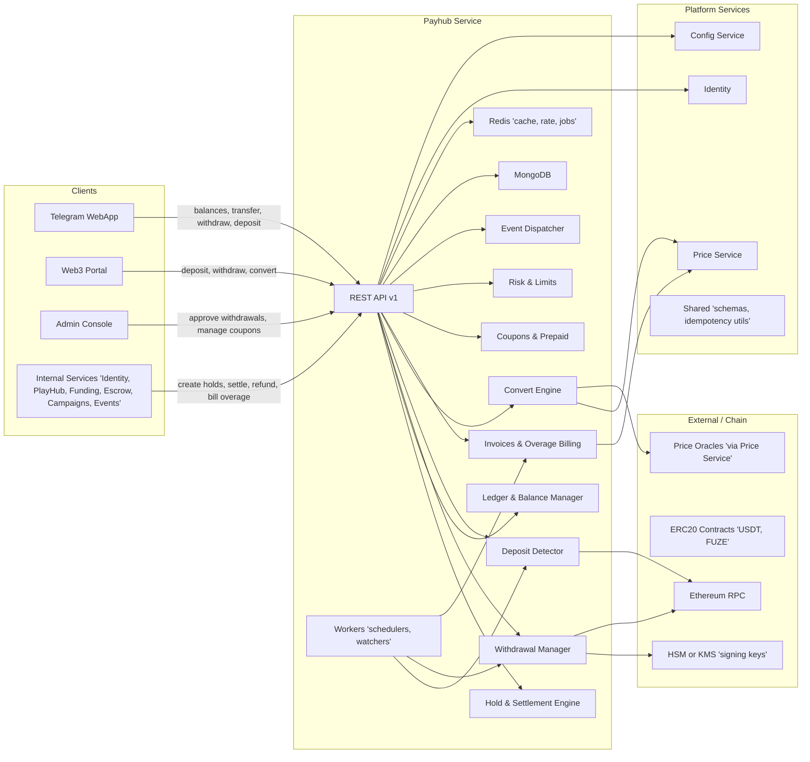
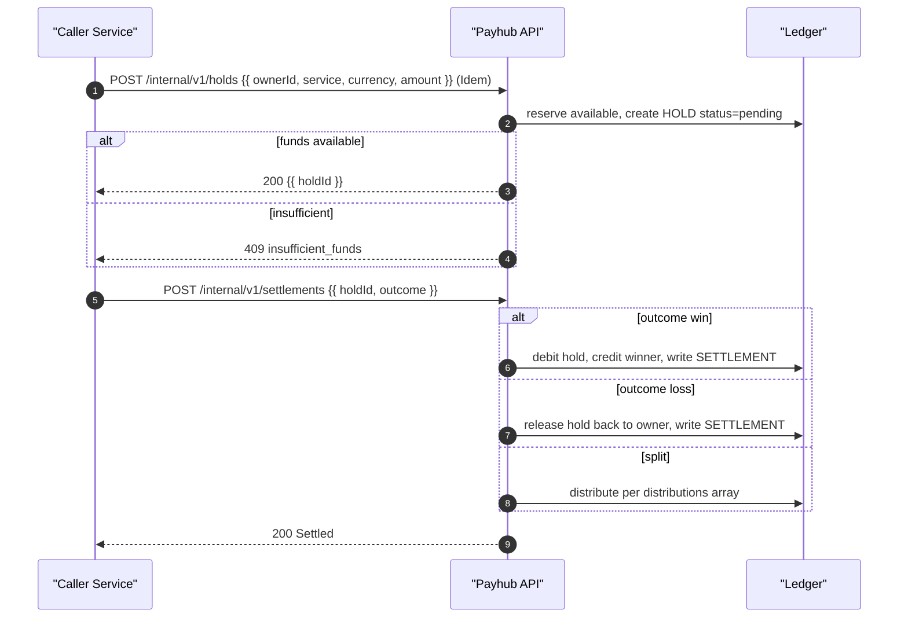
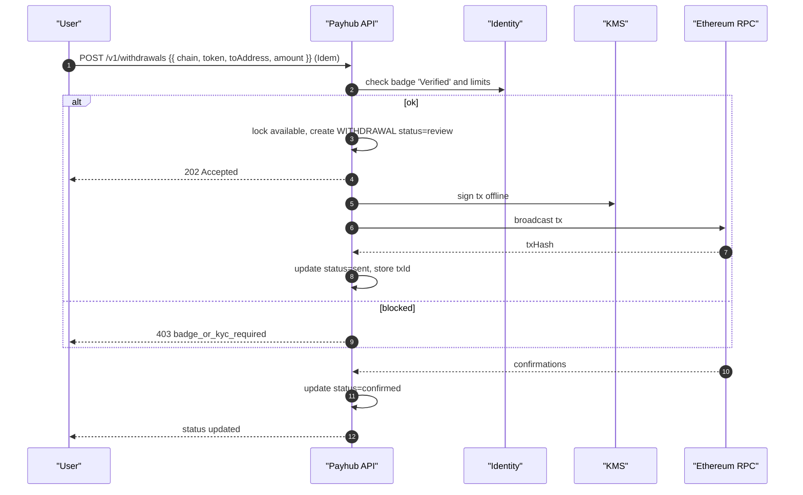
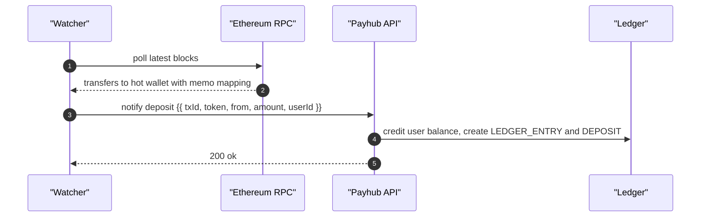
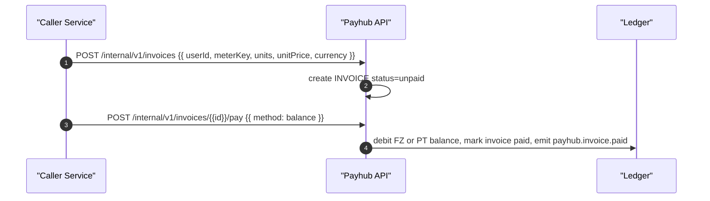

# Miniapp Payhub Service
*Version:* v0.1.0  
*Owner:* FUZE Platform Finance — Ledger, Holds, Settlements

> High‑level architectural blueprint for the **Payhub Service**. Payhub is the **single source of truth for balances** in platform currencies (**USDT, FUZE, STAR, FZ, PT** in MVP). It provides internal primitives: **Accounts, Ledger, Holds, Settlements, Conversions, Deposits, Withdrawals**. No games or business rules live here. Domain services (PlayHub, Funding, Campaigns, Escrow) call Payhub to **lock value** and **settle outcomes**. End users never call Payhub directly — WebApp uses domain services; Admin uses a BFF.

---

## 1) Architecture Diagram

*Notes:* Payhub performs **atomic** balance updates using Mongo transactions. All POSTs require `Idempotency-Key`. Domain services pass a **correlation id** (room id, bet id, escrow id) for traceability.

---

## 2) Technology Stack
| Layer | Choice | Rationale |
|---|---|---|
| Runtime | Nodejs 20 plus TypeScript | Shared platform stack |
| Framework | Express plus Zod | Predictable schemas and errors |
| Storage | MongoDB transactions | Per currency accounts and ledger entries |
| Cache | Redis | Idempotency, locks, and rate limits |
| Auth | jose Ed25519 JWT | Service to service auth |
| Telemetry | OpenTelemetry plus Pino | Tracing and structured logs |
| Deploy | Docker plus Helm | Uniform CI and CD |

---

## 3) Responsibilities and Scope
**Owns**
- **Accounts**: per user per currency balances with available and locked.  
- **Ledger**: append‑only double entry journal per movement with correlation id.  
- **Holds**: create and cancel holds that reduce available balance.  
- **Settlements**: settle holds to **win** or **loss** and move funds accordingly.  
- **Deposits**: credit from platform treasuries or external providers (MVP manual credit).  
- **Withdrawals**: request, review, and approve; debit to external addresses or off platform (MVP manual).  
- **Conversions**: optional internal FX between platform currencies using provided quotes.  

**Out of scope**
- Business decisions (who wins, bet logic, escrow dispute) — decided by domain services.  
- External custody or blockchain integration in MVP (future adapters).  
- End user UI — handled by WebApp via domain services or Admin BFF.

---

## 4) Data Flows

### 4.1 Create Hold → Settle Win/Loss

### 4.2 Withdrawal (KYC/badge gated)

### 4.3 Deposit detection

### 4.4 Overage invoice pay in FZ/PT

---

## 5) Accounting Model

- **Double entry**: every movement is recorded with a **debit** and a **credit** entry between two accounts.  
- **Holds**: reduce `available` and increase `locked` on the **holder** account; no ledger entries until settlement.  
- **Settlement win**: decrease holder `locked`, increase winner `available`; write two ledger entries: `hold_release` and `settlement_win`.  
- **Settlement loss**: decrease holder `locked`, increase **treasury** `available`.  
- **Release**: decrease `locked`, increase `available` on the same account.  
- **Fees**: optional fee basis points charged to the **winner** and credited to **treasury**.  
- **Conversions**: two ledger entries for the buy and fee; rate snapshot id recorded.

All operations are transactional and idempotent per `Idempotency-Key`.

---

## 6) Security and Compliance
- **Auth**: service JWTs with issuer and audience allow lists; optional mTLS.  
- **Idempotency**: Redis backed keys with 48 h retention for all POSTs.  
- **Rate limits**: per caller and per user operations.  
- **Validation**: Zod DTOs; currency allow list and integer amounts.  
- **Audit**: all POSTs create a ledger trail plus request audit record.  
- **Secrets**: signer keys and DB creds in secret manager.  
- **Privacy**: store user ids only; no PII.  
- **Change control**: withdrawal approvals require Admin two person rule.

---

## 7) Scalability and Reliability
- Stateless API nodes with Redis for idempotency; horizontal scale.  
- MongoDB transactional writes; tune write concerns and indexes.  
- SLOs: p95 < 120 ms for holds and settlements under light contention.  
- Health probes `/healthz` and `/readyz` include DB, Redis, and key freshness.  
- DR: daily backups; PITR recommended.

---

## 8) Observability
- **Tracing**: propagate `requestId`; spans annotate `userId`, `currency`, `holdId`.  
- **Metrics**: holds created per minute, settlement rates, locked vs available, failed idempotency conflicts.  
- **Logs**: structured logs without secrets; correlation id present.  
- **Alerts**: surge in failed settlements, DB latency, lock contention.

---

## 9) User Stories and Feature List
### Feature List
- Internal holds and settlements with optional fees.  
- Deposits credit and withdrawal review flow.  
- Ledger query and receipts for audits.  
- Optional conversions with quotes.

### User Stories
- *As PlayHub*, I can lock stakes and settle winners safely.  
- *As Funding*, I can credit participants and later process withdrawals.  
- *As Campaigns*, I can credit rewards from a treasury account idempotently.  
- *As Admin*, I can review withdrawals with a clear ledger trail.

---

## 10) Compatibility Notes
- Trusted by **PlayHub**, **Funding**, **Campaigns**, **Escrow** via internal network only.  
- WebApp does not call Payhub directly; Admin BFF proxies staff actions.  
- DTOs and error envelopes align with `tg-miniapp-shared`; flags come from `tg-miniapp-config`.
