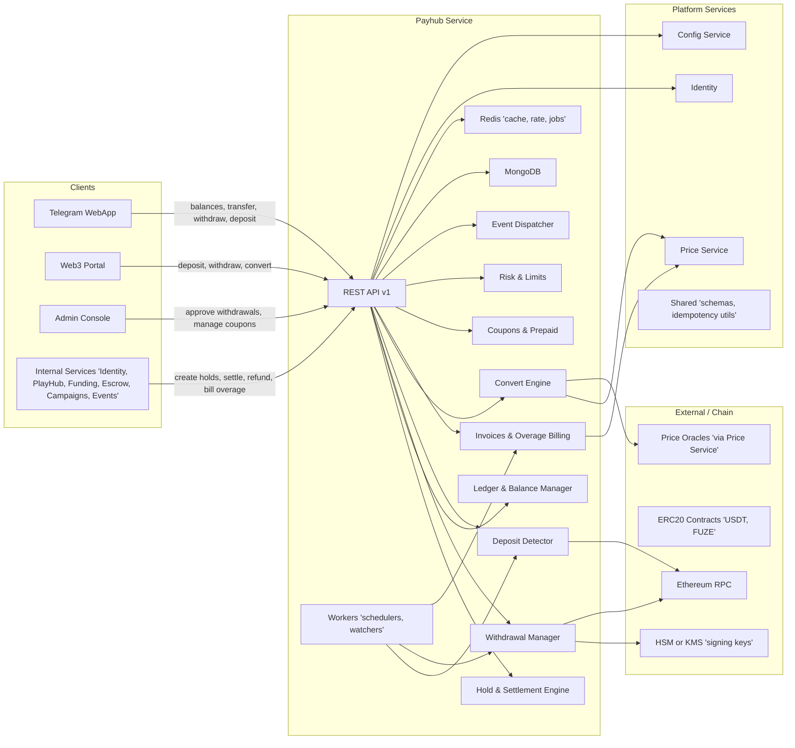
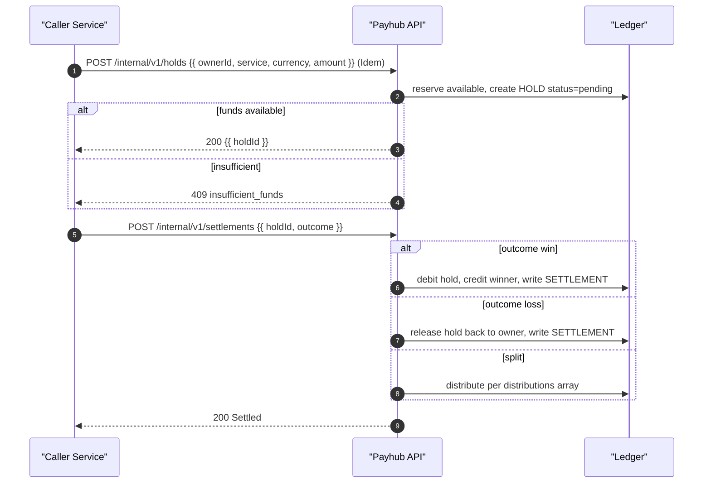
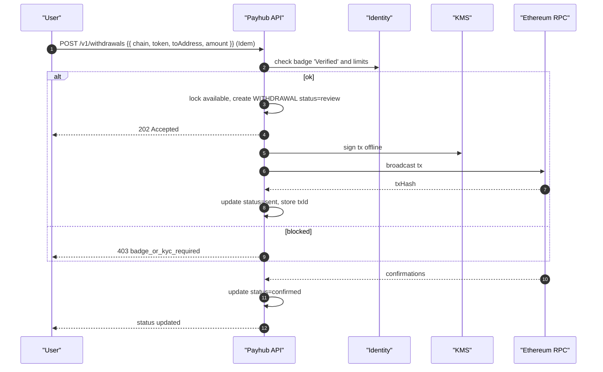
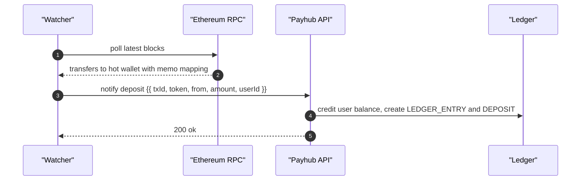
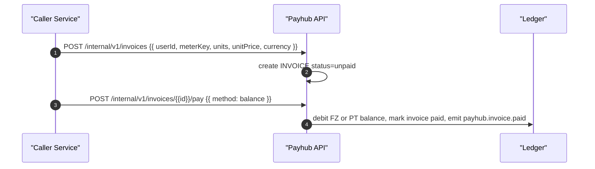

# Miniapp Payhub Service
*Version:* v0.1.0  
*Owner:* FUZE Platform Finance — Ledger, Holds, Settlements

> High‑level architectural blueprint for the **Payhub Service**. Payhub is the **single source of truth for balances** in platform currencies (**USDT, FUZE, STAR, FZ, PT** in MVP). It provides internal primitives: **Accounts, Ledger, Holds, Settlements, Conversions, Deposits, Withdrawals**. No games or business rules live here. Domain services (PlayHub, Funding, Campaigns, Escrow) call Payhub to **lock value** and **settle outcomes**. End users never call Payhub directly — WebApp uses domain services; Admin uses a BFF.

---

## 1) Architecture Diagram

*Notes:* Payhub performs **atomic** balance updates using Mongo transactions. All POSTs require `Idempotency-Key`. Domain services pass a **correlation id** (room id, bet id, escrow id) for traceability.

---

## 2) Technology Stack

| Layer | Choice | Notes |
|---|---|---|
| Runtime | Node.js 20 + TypeScript | Uniform across platform |
| API | Fastify + Zod + OpenAPI 3.1 | Strict request/response validation |
| Data | MongoDB (replica set) | Double-entry ledger, balances, holds, settlements, w/d, deposits, invoices |
| Cache/Jobs | Redis + BullMQ | Idempotency, queues, DLQ, schedulers |
| Cryptography | Ed25519 (jose), HMAC-SHA256 | JWT verify, webhook signatures |
| Keys | Cloud KMS or HSM | Withdrawal signing keys, rotation |
| Chain | Ethereum JSON-RPC, ERC-20 | USDT and FUZE on EVM networks |
| Observability | OpenTelemetry, Prometheus, Loki | RED/USE dashboards |
| CI/CD | Docker, Helm, Argo CD | Blue/green deploy |
| Timezone | Presentation GMT+7, system UTC | Consistent timestamps |

---

## 3) Responsibilities and Scope
**Owns**
- **Custody (off‑chain)** for STAR, FZ, PT with internal ledger and balances.
- **Holds and settlements** for platform services (matchmaking bets, CFB, escrow, funding).
- **Deposits and withdrawals** for ERC‑20 **USDT** and **FUZE** via Web3 Portal, signed by hot wallet with KMS control.
- **Conversion** and pricing snapshots between STAR/FZ/PT and USDT reference (via Price Service).
- **Overage billing**: issue invoices, accept payment in **FZ/PT**, coupons, prepaid credits.
- **Limits & risk**: daily withdrawal caps, velocity checks, sanctions blocklist via Identity/Config.
- **Events & audit** for financial actions.

**Collaborates**
- Identity (badges/KYC, org roles), Config (fees, limits, tax), Price Service (quotes), Shared (ids, signatures).

**Explicit non-goals**
- On‑chain market-making, DEX routing, fiat rails, KYC document storage.

**SLAs**
- Create hold P95 ≤ 120 ms, Settle P95 ≤ 200 ms (ex‑RPC), Withdrawal create P95 ≤ 250 ms.
---

## 4) Data Flows

### 4.1 Create Hold → Settle Win/Loss

### 4.2 Withdrawal (KYC/badge gated)

### 4.3 Deposit detection

### 4.4 Overage invoice pay in FZ/PT

---

## 5) Accounting Model

- **Currencies**: STAR, FZ, PT (off‑chain), USDT, FUZE (on‑chain). Balances maintained per currency.  
- **Fees**: config driven percentage + fixed. Withdrawal fee may be network or flat. Fees posted as separate ledger entries to treasury account.  
- **Holds**: reduce `available`, increase `pending`; expire by TTL, auto‑release.  
- **Settlement**: `win` moves pending to counterparty, `loss` releases to owner, `split` distributes per request.  
- **Quotas & overage**: free monthly limits — withdrawals count, conversions count, internal transfers count; on exceed, create invoice priced in FZ/PT; coupons and prepaid applied first.  
- **Badges/KYC gates**:  
  - Withdrawals: **Verified** badge required, large amounts require **Pro** badge.  
  - High‑velocity internal transfers may require **Investor** or **Trader** depending on service context.  
- **Idempotency**: all POST accept `Idempotency-Key`; duplicate returns original result.  
- **Pricing snapshots**: conversions use Price Service rate with expiry.

All operations are transactional and idempotent per `Idempotency-Key`.

---

## 6) Security and Compliance
- **Auth**: service JWTs with issuer and audience allow lists; optional mTLS.  
- **Idempotency**: Redis backed keys with 48 h retention for all POSTs.  
- **Rate limits**: per caller and per user operations.  
- **Validation**: Zod DTOs; currency allow list and integer amounts.  
- **Audit**: all POSTs create a ledger trail plus request audit record.  
- **Secrets**: signer keys and DB creds in secret manager.  
- **Privacy**: store user ids only; no PII.  
- **Change control**: withdrawal approvals require Admin two person rule.

---

## 7) Scalability and Reliability
- Stateless API nodes with Redis for idempotency; horizontal scale.  
- MongoDB transactional writes; tune write concerns and indexes.  
- SLOs: p95 < 120 ms for holds and settlements under light contention.  
- Health probes `/healthz` and `/readyz` include DB, Redis, and key freshness.  
- DR: daily backups; PITR recommended.

---

## 8) Observability
- **Tracing**: propagate `requestId`; spans annotate `userId`, `currency`, `holdId`.  
- **Metrics**: holds created per minute, settlement rates, locked vs available, failed idempotency conflicts.  
- **Logs**: structured logs without secrets; correlation id present.  
- **Alerts**: surge in failed settlements, DB latency, lock contention.

---

## 9) User Stories and Feature List
### Feature List
- Internal holds and settlements with optional fees.  
- Deposits credit and withdrawal review flow.  
- Ledger query and receipts for audits.  
- Optional conversions with quotes.

### User Stories
- *As PlayHub*, I can lock stakes and settle winners safely.  
- *As Funding*, I can credit participants and later process withdrawals.  
- *As Campaigns*, I can credit rewards from a treasury account idempotently.  
- *As Admin*, I can review withdrawals with a clear ledger trail.

---

## 10) Compatibility Notes
- Trusted by **PlayHub**, **Funding**, **Campaigns**, **Escrow** via internal network only.  
- WebApp does not call Payhub directly; Admin BFF proxies staff actions.  
- DTOs and error envelopes align with `tg-miniapp-shared`; flags come from `tg-miniapp-config`.
