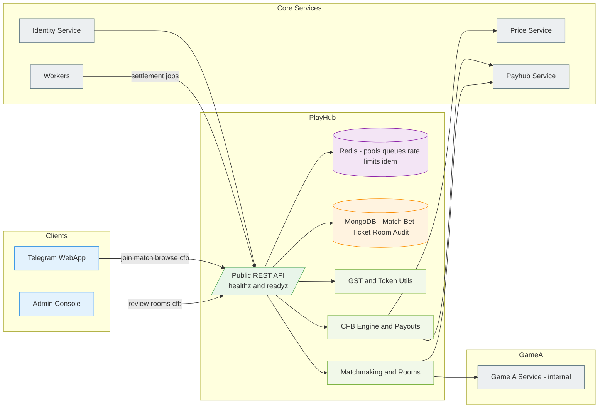
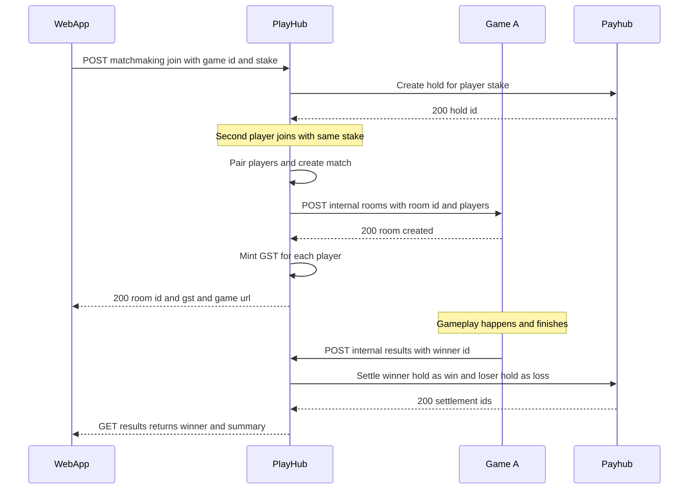
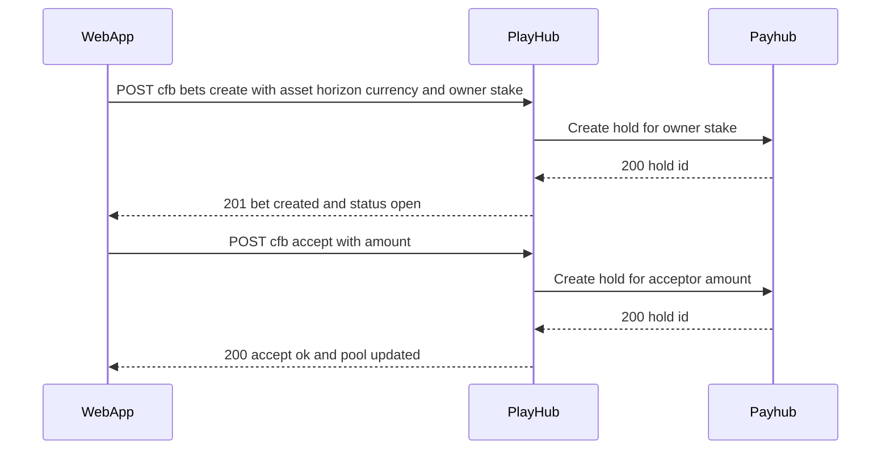
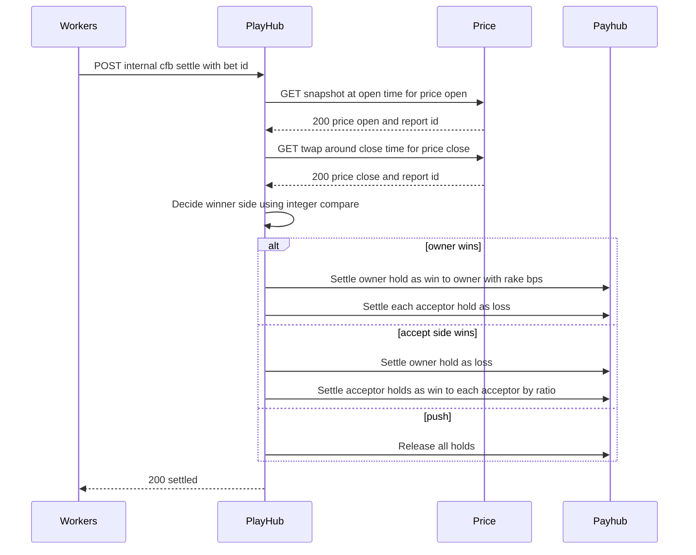

# Miniapp Playhub Service
*Version:* v0.2.0  
*Last Updated:* 2025-09-24 03:09 +07  
*Owner:* FUZE Games Platform — Matchmaking, Rooms, CFB v1

> High‑level architectural blueprint for **PlayHub**. This service powers PvP matchmaking and room orchestration for first‑party and partner games, and implements **Crypto Fair Bet v1 (CFB v1)** with off‑chain custody limited to **STAR, FZ, PT** for MVP. PlayHub performs **server‑to‑server** calls to game backends and Payhub, and reads prices from Price Service. End users never interact with Payhub directly.

---

## 1) Architecture Diagram

*Notes:* Game services are **independent** deployments that trust PlayHub via allow lists. Game UIs authenticate to game backends using a **GST** (Game Session Token) minted by PlayHub.

---

## 2) Technology Stack
| Layer | Choice | Rationale |
|---|---|---|
| Runtime | Nodejs 20 and TypeScript | Shared stack across repos |
| Framework | Express and Zod | Schema validation and consistent errors |
| Storage | MongoDB | Flexible matches and bets |
| Cache | Redis | Pools, tickets, idempotency, rates |
| Auth | jose Ed25519 JWT | Session and GST tokens |
| Telemetry | OpenTelemetry and Pino | Tracing and logs |
| Deploy | Docker and Helm | Standard CI and CD |

---

## 3) Responsibilities and Scope
**Owns**
- **Matchmaking**: queue players by game and stake, pair, create rooms, mint GSTs, redirect to game URL.  
- **Results intake**: accept server‑to‑server results from game backends.  
- **Settlement**: call **Payhub** to settle stakes.  
- **CFB v1**: create and accept owner bets on token prices using STAR FZ PT only; compute results with Price Service and settle with rake.  
- **Audit**: immutable events and operator queries.

**Out of scope**
- Price ingestion and signing — delegated to **Price Service** and **Workers**.  
- Ledger management — delegated to **Payhub**.  
- Gameplay networking — in the game backend.

---

## 4) Flows

### 4.1 Matchmaking and Game Result

### 4.2 CFB v1 Create and Accept

### 4.3 CFB v1 Settle

**CFB payout policy (MVP)**  
- Currencies: **STAR, FZ, PT** only.  
- Owner sets **ownerStake** and horizon. Anyone may **accept** with same currency and any amount until **closeAcceptAt** which is not later than half of horizon.  
- Determine **priceOpen** at bet creation time by snapshot or shortly after.  
- Determine **priceClose** at target time using **TWAP** over one minute window.  
- Winner side receives the **pot minus rake**: `rakeBps = 700` default.  
- If accept side wins, each acceptor payout equals `acceptorAmount divided by totalAcceptPool times winnerPot`.  
- If data degraded or price window invalid, bet becomes **push** and holds are released.

---

## 5) Security and Anti‑Abuse
- **GST**: signed token with `userId`, `roomId`, `gameId`, and short expiry; verified by game backends.  
- **Server to server**: only game backends can call results endpoint; allow list and service JWT.  
- **Idempotency**: all POST routes require `Idempotency-Key`.  
- **Rate limits**: per user for join and accept; Redis sliding windows.  
- **Validation**: Zod DTOs; currency allow list and integer amounts.  
- **Fairness**: price sources via Price Service with signed reports.  
- **Audit**: every state transition and settlement recorded.  
- **Abuse**: deny self matching in CFB and excessive self acceptance; optional owner cap per bet.

---

## 6) Scalability and Reliability
- Stateless API with Redis for pools and locks; horizontal scale.  
- Matchmaking uses Redis sorted sets and streams to avoid hot spots.  
- MongoDB for match and bet records with time based partitioning.  
- Workers schedule settle jobs for CFB and retry on degraded oracle.  
- SLOs: p95 < 120 ms for read and simple write paths.

---

## 7) Observability
- **Tracing**: spans include `roomId`, `betId`, `holdId`, `requestId`.  
- **Metrics**: matches created, queue time, accept rate, settlement latency, push rate.  
- **Logs**: structured logs with redaction; no GST printed.  
- **Alerts**: spike in settlement failures, high push rate, queue backlog.

---

## 8) User Stories and Feature List
### Feature List
- PvP matchmaking and room orchestration with GST mint and redirect.  
- Trusted results intake with Payhub settlement.  
- CFB v1 owner and accept flows, settlement with rake, and push handling.  
- Operator views via Admin and audit exports.

### User Stories
- *As a player*, I enter a stake and get matched to play a game fairly.  
- *As a game backend*, I receive a room create call and later report results securely.  
- *As a bettor*, I open a price bet and others accept; at target time the platform settles fairly using signed prices.  
- *As staff*, I can inspect rooms and bets and resolve issues via Admin.

---

## 9) Risks and Mitigations
- **Oracle degradation**: mark as push or delay via Workers; log report ids.  
- **Race conditions**: locks with Redis and idempotency keys; settlement checks.  
- **Version skew**: DTO versioning and capability flags.  
- **Fraud**: deny self dealing and rapid open close loops; rate limits and heuristics.

---

## 10) Compatibility Notes
- Verifies Identity session tokens and uses JWKS.  
- Calls Payhub for holds and settlements; never mutates balances directly.  
- Reads prices from Price Service only; no direct provider calls.  
- Works with WebApp, Admin, Workers, and the **game service template** for partners.
