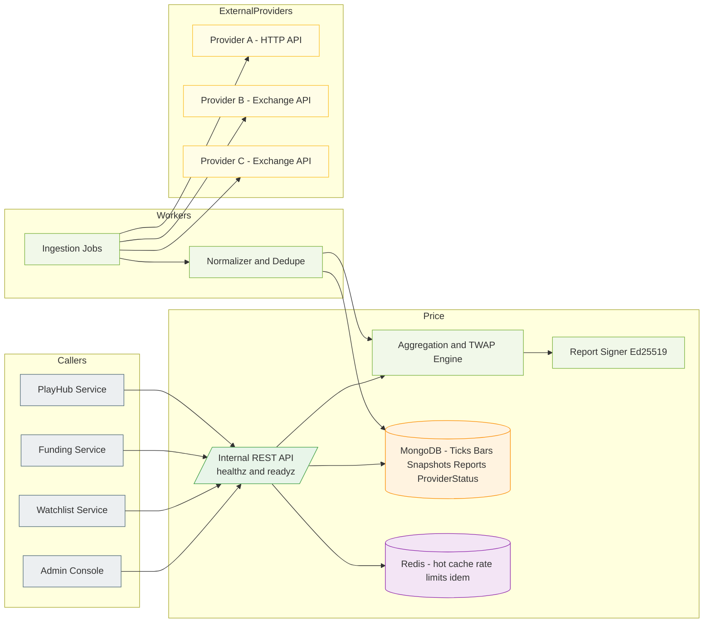
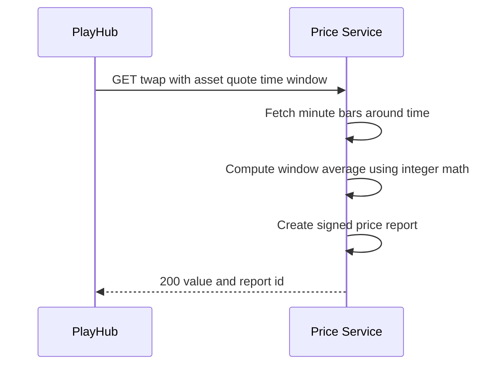
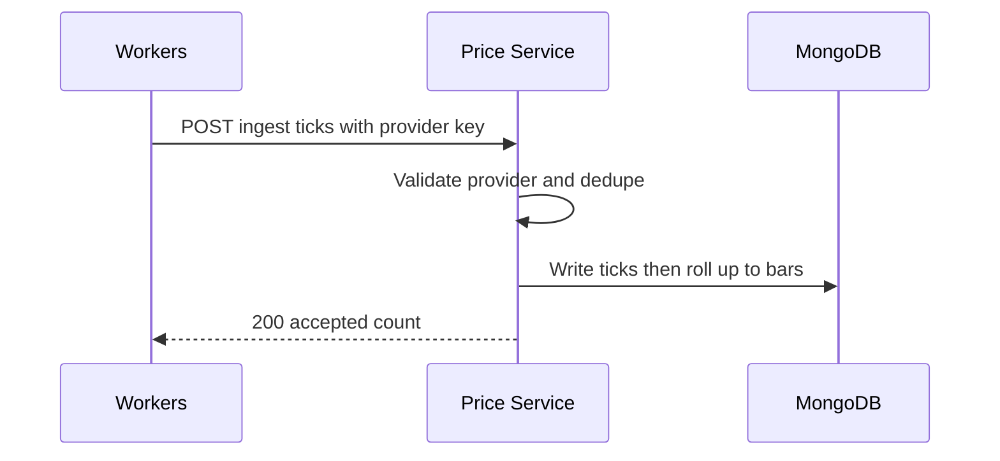
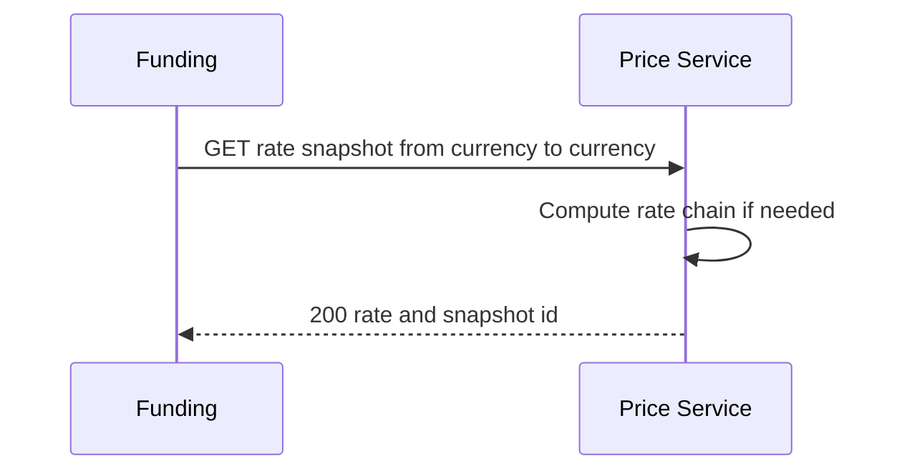

# Miniapp Price Service
*Version:* v0.1.0  
*Last Updated:* 2025-09-24 02:36 +07  
*Owner:* FUZE Platform Data — Market Data and Oracles

> High‑level architectural blueprint for the **Price Service**. This service provides minute bars, snapshots, rate snapshots, and **TWAP** for platform assets used by PlayHub CFB, Funding conversions, Watchlist feeds, and Admin audits. It ingests from approved providers via Workers, computes aggregates, signs **Price Reports**, and exposes **internal only** APIs to other services. No direct end‑user calls.

---

## 1) Architecture Diagram

*Notes:* Ingestion runs in **tg-miniapp-workers** with provider adapters. Price Service focuses on storage, aggregation, and serving signed reports. All consumers authenticate with **service JWTs**.

---

## 2) Technology Stack
| Layer | Choice | Rationale |
|---|---|---|
| Runtime | Nodejs 20 plus TypeScript | Shared stack |
| Framework | Express plus Zod | Schema validation and error envelopes |
| Storage | MongoDB | Time series bars and reports |
| Cache | Redis | Hot snapshots and TWAP cache |
| Auth | jose Ed25519 JWT | Service to service auth |
| Signing | Ed25519 via tweetnacl or jose | Lightweight signatures |
| Telemetry | OpenTelemetry plus Pino | Tracing and logs |
| Deploy | Docker plus Helm | Standard CI and CD |

---

## 3) Responsibilities and Scope
**Owns**
- **Snapshots** of asset quote pairs like BTC USD and ETH USD.  
- **Minute bars** open high low close volume for timeframes like 1m and 5m.  
- **TWAP** over a window for decision points like CFB ends.  
- **Signed price reports** with Ed25519 for auditability.  
- **Provider health** and quorum policy with outlier trimming.  
- **Reference FX rates** for platform currencies conversions when allowed.

**Out of scope**
- Direct trading or exchange account keys.  
- End user price charts beyond basic needs exposed via Watchlist.  
- On chain oracle posting in MVP.

---

## 4) Data Flows

### 4.1 TWAP Query from PlayHub

Rules: integer math only; rounding down; clearly defined window alignment and padding when bars are missing. If quorum below threshold, TWAP returns status degraded and PlayHub may treat it as push in CFB.

### 4.2 Ingestion from Workers

Workers call approved providers on schedules like each minute and pass normalized ticks.

### 4.3 Rate Snapshot for Funding

---

## 5) Calculation Policies

- **Quorum**: at least N providers or last good from M minutes if partial outage.  
- **Outlier trim**: drop top and bottom X percent before averaging.  
- **TWAP**: time aligned windows using bar midpoints or last close policy; window length must be equal or greater than one minute; step size equals bar timeframe.  
- **Rounding**: always round down towards zero; final integer scaling documented as micro units.  
- **Degraded mode**: if data stale beyond threshold, return degraded flag; callers decide policy such as push or disable conversions.

---

## 7) Security and Reliability
- **Auth**: service JWT allow lists; optional mTLS in cluster.  
- **Idempotency**: required on ingest POSTs; dedupe by provider key and ts.  
- **Rate limits**: per caller and provider.  
- **Validation**: asset and quote allow lists; integer ranges enforced.  
- **Availability**: stateless API; cache hot snapshots; fallbacks to last good with staleness indicator.  
- **Backups**: daily backups and PITR recommended.  
- **Secrets**: provider keys only in Workers; Price Service stores public keys for report verify.

---

## 8) Observability
- **Tracing**: spans for queries and ingestion; include asset and quote tags.  
- **Metrics**: provider health, tick lag, bar rollup time, twap latency, report sign rate.  
- **Logs**: structured redacted logs; no provider secrets.  
- **Alerts**: stale data alerts per pair, quorum failure, ingestion errors.

---

## 10) User Stories and Feature List
### Feature List
- Internal price snapshots and bars.  
- TWAP computation with signed reports.  
- Reference rates for platform currency conversions.  
- Provider health tracking and degraded flags.  
- Ingestion with dedupe and rollups.

### User Stories
- *As PlayHub*, I can fetch a TWAP around a decision time so that CFB settlements are fair and auditable.  
- *As Funding*, I can obtain a rate snapshot so that conversions and quotes are consistent.  
- *As Watchlist*, I can render an asset page with a current snapshot and recent bars.  
- *As Admin*, I can download a signed price report for a settlement dispute.

---

## 11) Roadmap
- Multi signature reports and threshold signing.  
- On chain posting adapter.  
- Additional providers and per pair weighting.  
- WebSocket push for subscribed consumers.

---

## 12) Compatibility Notes
- Trusted by PlayHub, Funding, Watchlist, and Admin via internal network.  
- Ingestion runs in Workers; Price Service exposes only validation and storage endpoints.  
- DTOs and error envelopes via `tg miniapp shared`; config via `tg miniapp config`.
