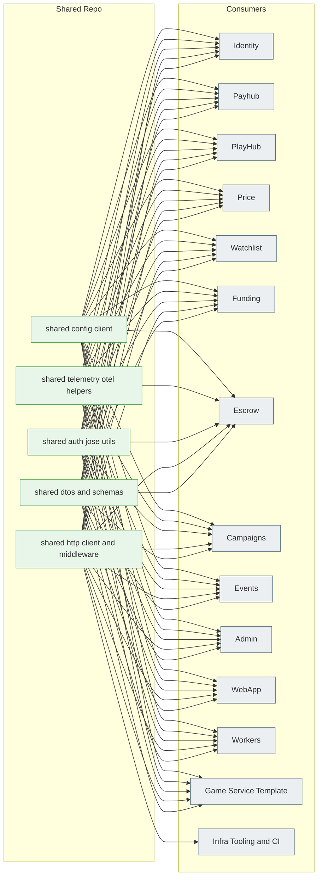
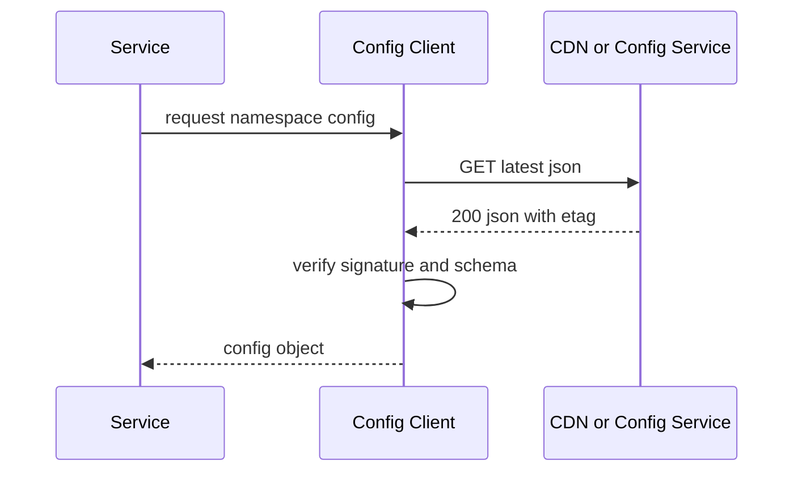

# SystemDesign.md — **tg-miniapp-shared**
*Version:* v0.1.0  
*Last Updated:* 2025-09-24 04:02 +07  
*Owner:* FUZE Platform Core — Shared SDKs, DTOs, Middlewares, Contracts

> High level architectural blueprint for the **Shared** repo. This repository provides versioned **TypeScript packages** consumed by all services and frontends: common **DTOs**, **Zod schemas**, **error envelopes**, **auth utilities** for JWT verify and sign, **request clients** with retries and idempotency helpers, **OpenTelemetry** helpers, and a **Config Client** that fetches and verifies signed configs from **tg miniapp config**. No runtime service is deployed from this repo.

---

## 1) Architecture Diagram

*Notes:* Each package is published with **semantic versioning** to an internal registry. Services pin compatible versions and only bump intentionally. The Shared repo acts as a **single source of truth** for contracts and cross cutting helpers.

---

## 2) Technology Stack
| Area | Choice | Rationale |
|---|---|---|
| Language | TypeScript | Single language across repos |
| Build | tsup or tsup plus rollup | Fast ESM and CJS outputs |
| Validation | Zod | Shared runtime validation and types |
| Auth | jose Ed25519 | Same crypto as services |
| HTTP | undici fetch with retry | Lightweight and fast |
| Telemetry | OpenTelemetry | Common tracing and metrics |
| Packaging | npm workspaces | Multi package management |
| Registry | GitHub Packages or private npm | Internal distribution |

---

## 3) Responsibilities and Scope
**Owns**
- **DTOs and Zod Schemas** for all service boundaries and WebApp payloads.  
- **Error model** and helpers to ensure consistent error envelopes.  
- **Auth utils** to mint service JWTs and verify session JWTs and GST.  
- **HTTP client** with retries, backoff, timeouts, idempotency keys, and correlation headers.  
- **Config client** to fetch and verify **signed configs** from **tg miniapp config**.  
- **Telemetry helpers**: request tracing, Pino serializers, metric instruments.  
- **Types for currencies and assets** used platform wide.  
- **Id generators** and ULID helpers for correlation ids and entity ids.  
- **Date and money math** using integers, no floats.

**Out of scope**
- Business logic of any domain.  
- Service deployment or runtime; this repo ships libraries only.

---

## 4) Contracts and Error Model

### 4.1 Error Envelope
```
{
  "error": true,
  "code": "bad_request",
  "message": "invalid payload",
  "requestId": "r-01H...",
  "details": [
    { "path": "amount", "msg": "must be positive integer" }
  ]
}
```
- Consistent codes like bad_request, unauthorized, forbidden, not_found, conflict, rate_limited, internal.  
- Helpers convert Zod errors into details arrays.  
- Include requestId for traceability.

### 4.2 Headers
- Authorization Bearer for tokens.  
- X Request Id correlation header.  
- Idempotency Key on all POSTs that mutate state.

### 4.3 DTO Versioning
- DTOs carry a v field for breaking changes.  
- Backwards compatible fields are optional then tightened later.  
- Services can feature flag or capability advertise using config values and headers.

---

## 5) Auth Utilities
- Session JWT verify: verify against Identity JWKS; check iss aud exp sub.  
- Service JWT sign and verify: sign with private JWK, verify audiences and issuer.  
- GST verify: PlayHub minted token containing userId roomId gameId.  
- Key rotation: JWKS cache with TTL and kid support.  
- Minimal Express middleware: function returning 401 on failure, attaching user to request.

---

## 6) HTTP Client
- createHttpClient baseUrl defaultHeaders timeoutMs returns a small client with:  
  - get post patch del returning typed results via Zod parse.  
  - Retry on 429 and selected 5xx with exponential backoff and jitter.  
  - Inject X Request Id and optional Idempotency Key.  
  - Timeouts per request and abort signals.  
  - Redaction for logs and toSafeError converter.

---

## 7) Config Client
- fetchSignedConfig env namespace downloads from CDN or Config Service.  
- Verifies signature against Config JWKS and validates schema.  
- Checks monotonic version and validFrom to avoid rollback.  
- In memory cache with ETag and stale while revalidate.  
- Used by all services and WebApp to pull feature flags and settings.

### 7.1 Flow


---

## 8) Telemetry Helpers
- Tracing: create tracer, child spans, context propagation, requestId binding.  
- Metrics: counters and histograms for http latency, retries, and parse failures.  
- Logging: Pino serializers to strip tokens and normalize errors.

---

## 9) Quality, Testing, and Publishing
- Unit tests for DTOs and helpers using Vitest or Jest.  
- Contract tests that parse sample payloads from each service.  
- Lint and type check via ESLint and tsc.  
- Publish on merge to main with conventional commits driving semver bump.  
- Changelog generated automatically.  
- Deprecation policy: mark DTO fields deprecated for one minor before removal.

---

## 10) Security
- No secrets in repo or packages.  
- Crypto via audited libs only; no custom code.  
- Safe defaults: integer money types, whitelist currencies and assets.  
- Supply chain: signed packages if registry supports it, lockfiles, provenance in CI.  
- License: permissive internal use license headers in each package.

---

## 11) Compatibility Notes
- Matches the endpoint lists and behaviors specified in service SystemDesign docs.  
- Config client aligns with tg miniapp config signed payload structure.  
- Auth helpers align with Identity JWKS and token semantics, PlayHub GST, and service JWTs used across repos.  
- HTTP client default headers and error envelopes match Payhub, PlayHub, Funding, Escrow, Campaigns, Watchlist, Price, Events, Admin, Workers.

---

## 12) User Stories and Feature List
### Feature List
- Shared DTOs and schemas, error model, and headers.  
- Auth and JWKS helpers, GST verification.  
- HTTP client with retries and idempotency.  
- Config client for signed configs.  
- Telemetry utilities.

### User Stories
- As a service developer, I import shared DTOs and the HTTP client so my service returns and consumes consistent payloads.  
- As a game developer, I verify GST and parse room messages using the shared schemas.  
- As a frontend developer, I fetch and apply feature flags using the config client.

---

## 13) Roadmap
- gRPC codegen variants if we add gRPC.  
- Browser friendly client bundle for WebApp only packages.  
- CLI to diff DTOs between versions and highlight breaking changes.
