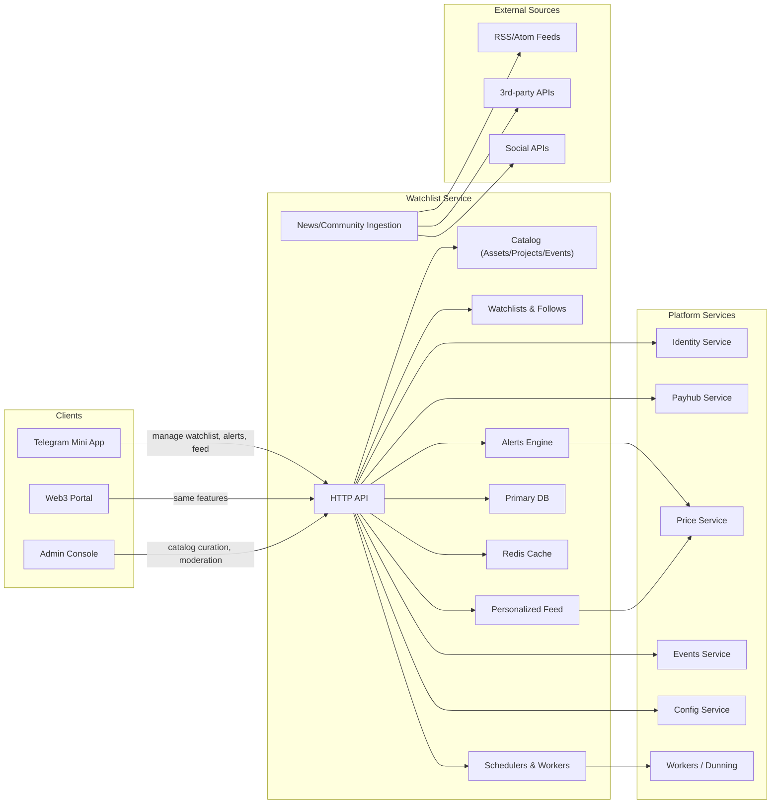
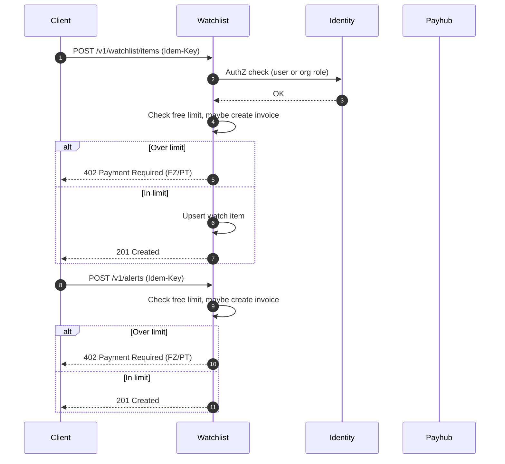
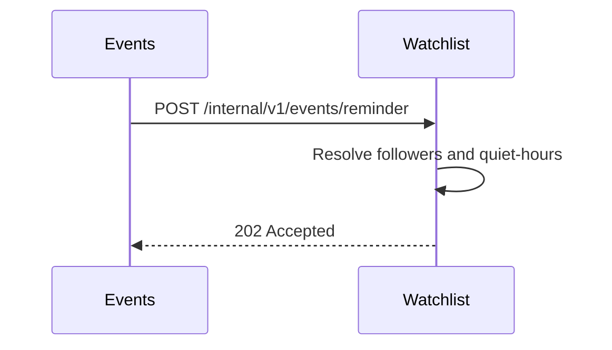
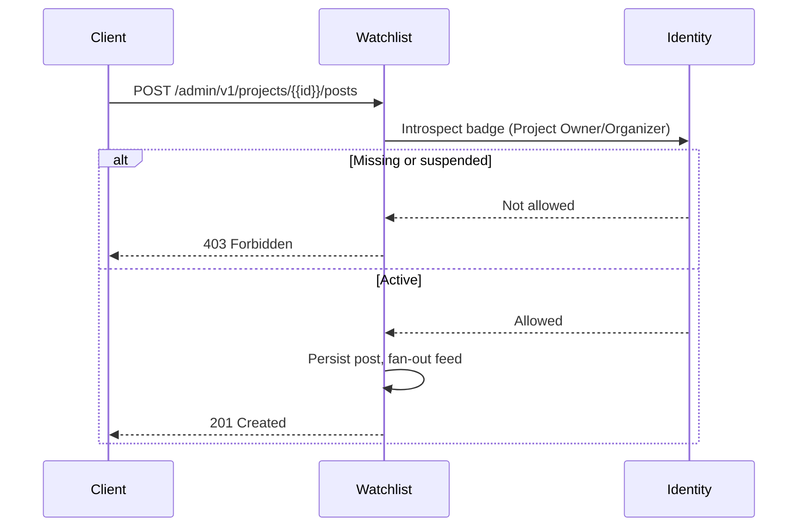

# Miniapp Watchlist Service
*Version:* v0.1.1  
*Last Updated:* 2025-09-24 02:00 +07  
*Owner:* FUZE Discovery Engineering — Watchlists and Feeds

> High‑level architectural blueprint for the **Watchlist/Discovery Service** powering token watchlists, aggregated news, team and product profiles, community links, events references, and lightweight price sentiment and predictions. It interoperates with Identity, Price Service, Events, PlayHub, Campaigns, Admin, Workers, Config, Infra, and WebApp. The scope here is **read heavy discovery** and **user watchlists**, not trading or custody.

---

## 1) Architecture Diagram

*Notes:* Watchlist is **read heavy** with strict caching. It does not mutate ledgers or balances. Any pricing comes from **Price Service**; ingestion of external sources is performed by Workers that write to Watchlist, or by Workers that populate the Price Service separately.

---

## 2) Technology Stack
| Layer | Choice | Rationale |
|---|---|---|
| Runtime | Nodejs 20 plus TypeScript | Shared toolchain |
| Framework | Express plus Zod | Predictable DTO validation |
| Storage | MongoDB | Semi structured token and content data |
| Cache | Redis | Response cache, rate limits, idempotency for POSTs |
| Auth | jose Ed25519 JWT | Identity verified sessions |
| Telemetry | OpenTelemetry plus Pino | Unified tracing and logs |
| Config | tg miniapp config | Feature flags, limits, source allow list |
| Deploy | Docker plus Helm | Standard CI and CD |

---

## 3) Responsibilities and Scope
**Owns**
- **Watchlists**: create, update, and retrieve user token watchlists.  
- **Feeds**: aggregated timeline combining price moves, curated news, events references, and community updates.  
- **Profiles**: token and project profiles including team, product, and community links.  
- **Predictions**: simple user predictions and sentiment polls (off chain, non financial advice).  
- **Curation**: admin approved sources and taxonomies.

**Out of scope**
- Trading, custody, or payouts.  
- On chain data indexing beyond simple references.  
- Real money recommendations; content is informational only.

---

## 4) Data Flows

### 4.1 Add to watchlist then alert create with billing

### 4.2 Event reminders

### 4.3 Official update (badge gated)

---

## 5) Security and Privacy
- **Auth** via Identity; user routes require a valid session token.  
- **Idempotency** on POST and PUT to avoid duplicates; Redis store with 48 h retention.  
- **Rate limits** per user for predictions and list mutations.  
- **Validation** with Zod; asset symbols and URLs validated against allow lists.  
- **Curation**: only allow‑listed sources ingested; staff can pause sources.  
- **Content safety**: sanitize HTML summaries; safe link redirects.  
- **Privacy**: store only user id and list content; no PII.  
- **Compliance**: surface disclaimers that predictions and feeds are informational only.

---

## 6) Scalability and Reliability
- Stateless API; scale horizontally; Redis for caching hot endpoints.  
- MongoDB with time ordered indexes for fast feeds.  
- Workers handle ingestion, dedupe, and sentiment tagging; DLQ retries with backoff.  
- SLOs: p95 < 120 ms for feed reads under cache hit; < 250 ms on misses.  
- Health probes `/healthz` and `/readyz` verify DB, Redis, and config freshness.  
- DR: backups; PITR recommended.

---

## 7) Observability
- **Tracing**: propagate `requestId`; spans annotate `asset`, `feedKind`.  
- **Metrics**: cache hit rate, feed latency, ingestion lag, predictions per day.  
- **Logs**: structured and redacted; include user and list ids.  
- **Alerts**: cache miss surge, ingestion failures, source error spikes.

---

## 8) User Stories and Feature List
### Feature List
- User token watchlists CRUD.  
- Aggregated feed with price moves, news, and events.  
- Token and project profiles with curated links.  
- Simple predictions and sentiment tracking.  
- Admin curation of sources.

### User Stories
- *As a user*, I can maintain a watchlist of tokens so that I can track what matters to me.  
- *As a user*, I can view a single feed combining price, news, and events for an asset so that I do not need multiple apps.  
- *As a researcher*, I can open a token profile and follow official links safely.  
- *As staff*, I can pause a bad source quickly to keep the feed clean.

---

## 9) Roadmap
- Personalization ranking using engagement signals.  
- Browser push or Telegram notifications for watchlist alerts.  
- Richer NLP sentiment and entity linking.  
- Deep links into PlayHub and Campaigns when relevant events occur.

---

## 10) Compatibility Notes and Rename Impact
- Works with Identity tokens and JWKS rotation.  
- Calls Price and Events services securely.  
- Surfaces content to WebApp and Admin; Workers perform ingestion.  
- Does not call Payhub or mutate balances.  
- **Rename rollout:** update env names to `SVC_WATCHLIST_URL`; update Helm chart release and K8s service names; update Docker image tags; search and replace references in other repos' SystemDesign.md and READMEs; update Admin and WebApp to call the same endpoints under the **new service base URL**. DTOs and endpoint paths remain the same.
