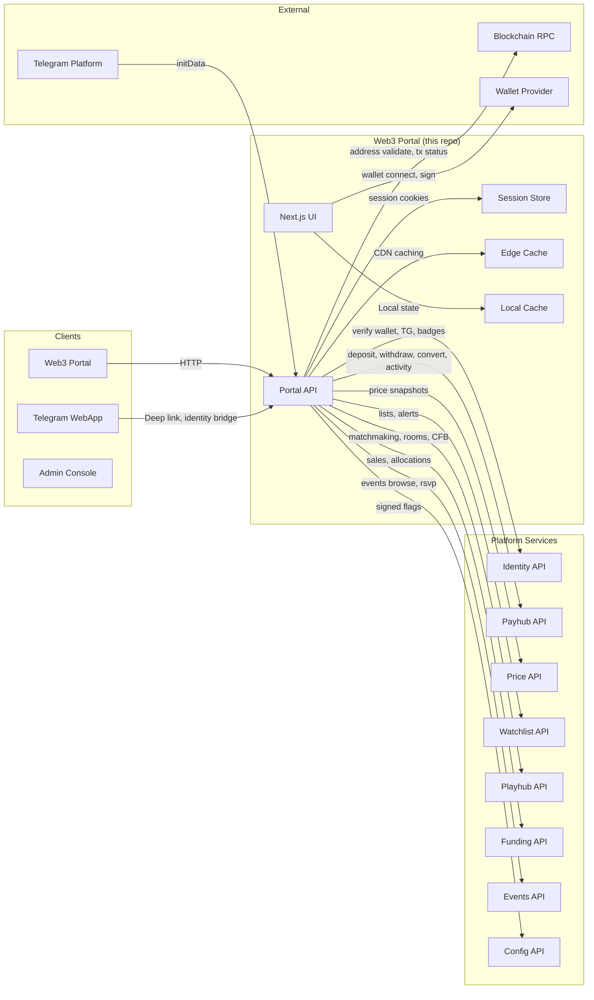
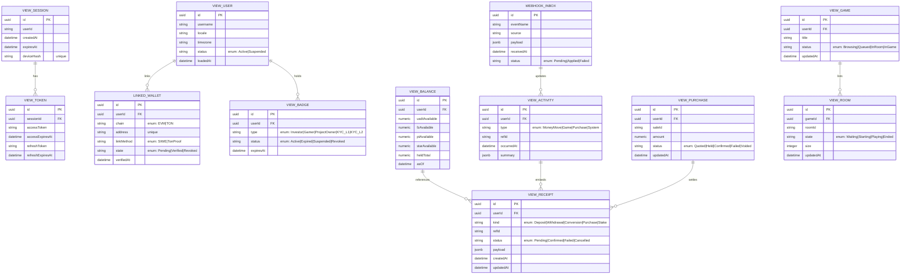
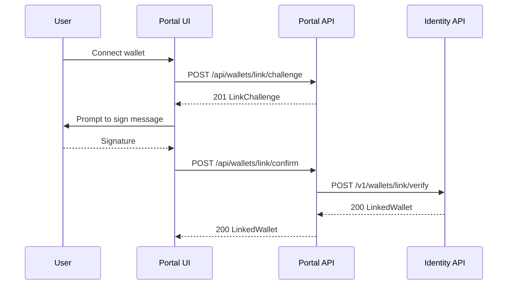
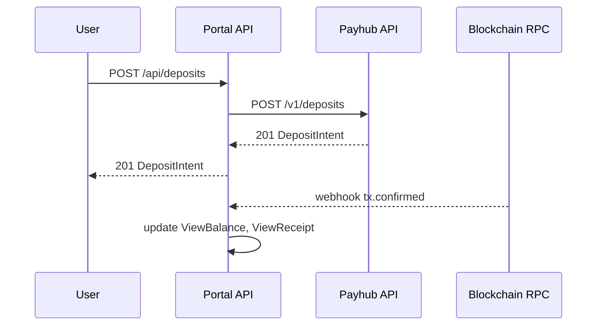
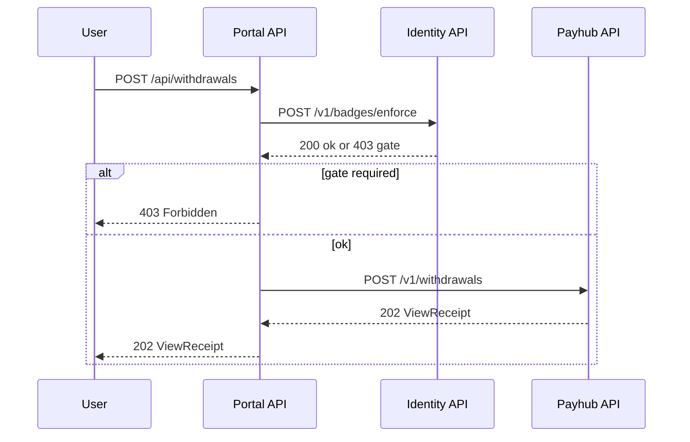
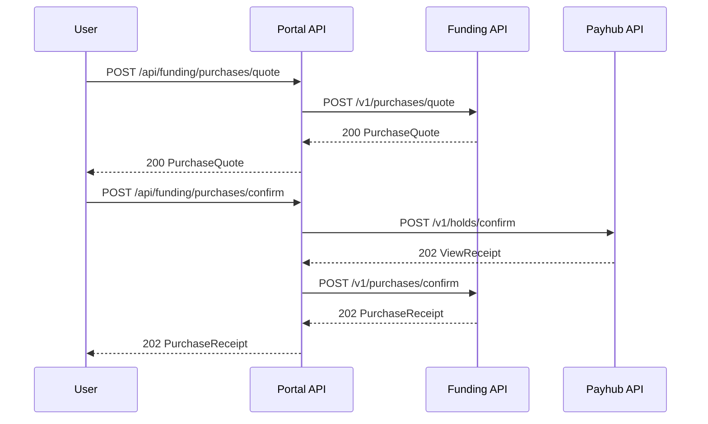
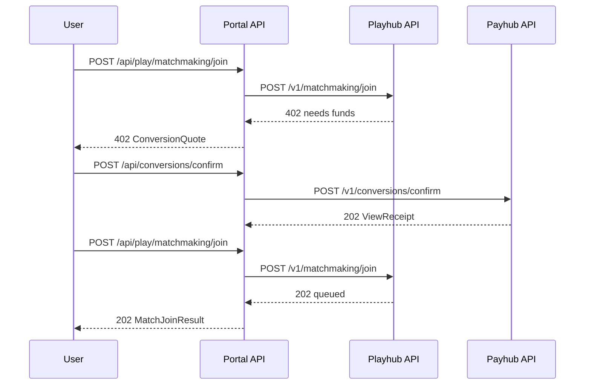
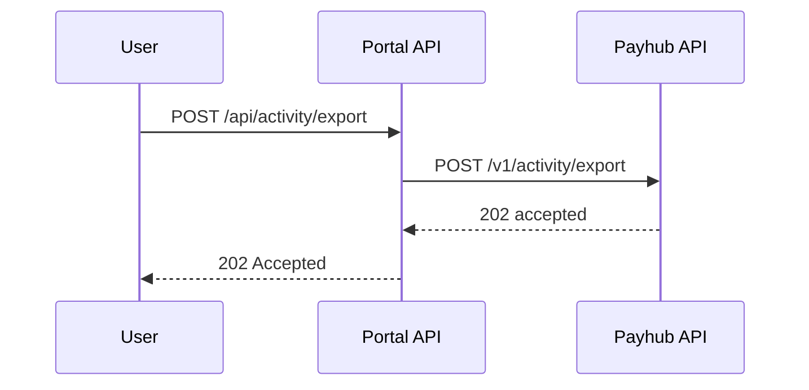

Repo: Web3 Portal


## 1. Architecture Diagram — Mermaid flowchart


---

## 2. Technology Stack

- **UI**: Next.js 14, React 18, TypeScript, App Router, TanStack Query, Zustand, i18n, Wagmi/Ethers for EVM, TonConnect for TON
- **Portal API (PAPI)**: Node.js 20, Fastify, TypeScript, OpenAPI‑first, Zod validation, Axios fan‑out
- **Security**: SIWE (EIP‑4361) and TonConnect signature verification, Telegram initData verification, JWT & httpOnly cookies, CSRF double‑submit
- **Caching**: Edge CDN for static and GET APIs, Redis for session & response cache, client IndexedDB for offline activity cache
- **Observability**: OpenTelemetry (traces, metrics, logs), RUM (LCP, INP), correlation‑ids
- **CI/CD**: GitHub Actions, preview deployments, feature flags via Config
- **Testing**: Contract tests to platform APIs, mock wallets, Playwright E2E

---

## 3. Responsibilities and Scope

**Owns**
- Wallet‑first UX for deposits, withdrawals, conversions, purchases, plays/CFB, and activity
- Wallet linking to Identity and Telegram bridge
- A **Portal API** that aggregates and normalizes backend contracts for the browser
- Quota/overage surfacing and payment UX (FZ/PT), gating flows for KYC/Badges

**Non‑goals**
- Not the source of truth for balances, sales, or matches
- No direct on‑chain writes from the UI without backend mediation

**Boundaries**
- Delegates verification and authorization to Identity
- Uses Payhub for money flows, Funding for purchases, Playhub for gameplay, Config for limits

---

## 4. Data Design — Mermaid erDiagram


---

## 5. Interfaces — OpenAPI 3.1 (YAML)

```yaml
openapi: 3.1.0
info:
  title: tg-web3-portal API
  version: 1.0.0
servers:
  - url: https://portal.api.fuze.local
security:
  - CookieAuth: []
  - BearerAuth: []
tags:
  - name: Session
  - name: Wallets
  - name: Balances
  - name: Payments
  - name: Funding
  - name: Play
  - name: Activity
  - name: Overage
  - name: Config
  - name: Webhooks
paths:
  /api/session/start:
    post:
      operationId: session.start
      summary: Start session from Telegram initData or wallet only
      tags: [Session]
      security: []
      requestBody:
        required: true
        content:
          application/json:
            schema:
              type: object
              required: [timezone]
              properties:
                initData: { type: string, nullable: true, description: Telegram initData }
                timezone: { type: string, default: "GMT+7" }
                deviceHash: { type: string }
      responses:
        "200":
          description: Session established
          headers:
            Set-Cookie: { schema: { type: string }, description: httpOnly refresh }
          content:
            application/json: { schema: { $ref: "#/components/schemas/ViewSession" } }
        "400": { $ref: "#/components/responses/BadRequest" }
        "429": { $ref: "#/components/responses/RateLimited" }
        "500": { $ref: "#/components/responses/ServerError" }

  /api/wallets/link/challenge:
    post:
      operationId: wallets.linkChallenge
      summary: Create SIWE or TonProof challenge
      tags: [Wallets]
      requestBody:
        required: true
        content:
          application/json:
            schema:
              type: object
              required: [address, chain]
              properties:
                address: { type: string }
                chain: { type: string, enum: [EVM, TON] }
      responses:
        "201": { description: Challenge created, content: { application/json: { schema: { $ref: "#/components/schemas/LinkChallenge" } } } }
        "401": { $ref: "#/components/responses/Unauthorized" }
        "429": { $ref: "#/components/responses/RateLimited" }
        "500": { $ref: "#/components/responses/ServerError" }

  /api/wallets/link/confirm:
    post:
      operationId: wallets.linkConfirm
      summary: Verify signature and link wallet to user
      tags: [Wallets]
      parameters:
        - in: header
          name: Idempotency-Key
          required: true
          schema: { type: string }
      requestBody:
        required: true
        content:
          application/json:
            schema:
              type: object
              required: [address, chain, signature]
              properties:
                address: { type: string }
                chain: { type: string, enum: [EVM, TON] }
                signature: { type: string }
                message: { type: string }
      responses:
        "200": { description: Linked, content: { application/json: { schema: { $ref: "#/components/schemas/LinkedWallet" } } } }
        "401": { $ref: "#/components/responses/Unauthorized" }
        "409": { $ref: "#/components/responses/Conflict" }
        "422": { $ref: "#/components/responses/Unprocessable" }
        "429": { $ref: "#/components/responses/RateLimited" }
        "500": { $ref: "#/components/responses/ServerError" }

  /api/balances:
    get:
      operationId: balances.get
      summary: Get balances snapshot
      tags: [Balances]
      responses:
        "200": { description: Balances, content: { application/json: { schema: { $ref: "#/components/schemas/ViewBalance" } } } }
        "401": { $ref: "#/components/responses/Unauthorized" }
        "500": { $ref: "#/components/responses/ServerError" }

  /api/deposits:
    post:
      operationId: payments.depositCreate
      summary: Create a deposit intent
      tags: [Payments]
      parameters:
        - in: header
          name: Idempotency-Key
          required: true
          schema: { type: string }
      requestBody:
        required: true
        content:
          application/json:
            schema:
              type: object
              required: [network, token, amount]
              properties:
                network: { type: string }
                token: { type: string }
                amount: { type: number, minimum: 0 }
      responses:
        "201": { description: Invoice, content: { application/json: { schema: { $ref: "#/components/schemas/DepositIntent" } } } }
        "401": { $ref: "#/components/responses/Unauthorized" }
        "422": { $ref: "#/components/responses/Unprocessable" }
        "429": { $ref: "#/components/responses/RateLimited" }
        "500": { $ref: "#/components/responses/ServerError" }

  /api/withdrawals:
    post:
      operationId: payments.withdrawCreate
      summary: Request withdrawal
      tags: [Payments]
      parameters:
        - in: header
          name: Idempotency-Key
          required: true
          schema: { type: string }
      requestBody:
        required: true
        content:
          application/json:
            schema:
              type: object
              required: [network, token, address, amount]
              properties:
                network: { type: string }
                token: { type: string }
                address: { type: string }
                amount: { type: number, minimum: 0 }
      responses:
        "202": { description: Accepted, content: { application/json: { schema: { $ref: "#/components/schemas/ViewReceipt" } } } }
        "401": { $ref: "#/components/responses/Unauthorized" }
        "403": { $ref: "#/components/responses/Forbidden" }
        "422": { $ref: "#/components/responses/Unprocessable" }
        "429": { $ref: "#/components/responses/RateLimited" }
        "500": { $ref: "#/components/responses/ServerError" }

  /api/conversions/quote:
    post:
      operationId: payments.conversionQuote
      summary: Quote token conversion
      tags: [Payments]
      requestBody:
        required: true
        content:
          application/json:
            schema:
              type: object
              required: [from, to, amount]
              properties:
                from: { type: string }
                to: { type: string }
                amount: { type: number, minimum: 0 }
      responses:
        "200": { description: Quote, content: { application/json: { schema: { $ref: "#/components/schemas/ConversionQuote" } } } }
        "401": { $ref: "#/components/responses/Unauthorized" }
        "422": { $ref: "#/components/responses/Unprocessable" }
        "500": { $ref: "#/components/responses/ServerError" }

  /api/conversions/confirm:
    post:
      operationId: payments.conversionConfirm
      summary: Confirm conversion with quote id
      tags: [Payments]
      parameters:
        - in: header
          name: Idempotency-Key
          required: true
          schema: { type: string }
      requestBody:
        required: true
        content:
          application/json:
            schema:
              type: object
              required: [quoteId]
              properties:
                quoteId: { type: string }
      responses:
        "202": { description: Accepted, content: { application/json: { schema: { $ref: "#/components/schemas/ViewReceipt" } } } }
        "401": { $ref: "#/components/responses/Unauthorized" }
        "422": { $ref: "#/components/responses/Unprocessable" }
        "429": { $ref: "#/components/responses/RateLimited" }
        "500": { $ref: "#/components/responses/ServerError" }

  /api/funding/purchases/quote:
    post:
      operationId: funding.purchaseQuote
      summary: Quote a sale allocation
      tags: [Funding]
      requestBody:
        required: true
        content:
          application/json:
            schema:
              type: object
              required: [saleId, amount]
              properties:
                saleId: { type: string }
                amount: { type: number, minimum: 0 }
      responses:
        "200": { description: Quote, content: { application/json: { schema: { $ref: "#/components/schemas/PurchaseQuote" } } } }
        "401": { $ref: "#/components/responses/Unauthorized" }
        "403": { $ref: "#/components/responses/Forbidden" }
        "422": { $ref: "#/components/responses/Unprocessable" }
        "500": { $ref: "#/components/responses/ServerError" }

  /api/funding/purchases/confirm:
    post:
      operationId: funding.purchaseConfirm
      summary: Confirm purchase with quote id
      tags: [Funding]
      parameters:
        - in: header
          name: Idempotency-Key
          required: true
          schema: { type: string }
      requestBody:
        required: true
        content:
          application/json:
            schema:
              type: object
              required: [quoteId]
              properties:
                quoteId: { type: string }
      responses:
        "202": { description: Accepted, content: { application/json: { schema: { $ref: "#/components/schemas/PurchaseReceipt" } } } }
        "401": { $ref: "#/components/responses/Unauthorized" }
        "403": { $ref: "#/components/responses/Forbidden" }
        "422": { $ref: "#/components/responses/Unprocessable" }
        "429": { $ref: "#/components/responses/RateLimited" }
        "500": { $ref: "#/components/responses/ServerError" }

  /api/play/matchmaking/join:
    post:
      operationId: play.matchJoin
      summary: Join matchmaking or CFB from portal
      tags: [Play]
      parameters:
        - in: header
          name: Idempotency-Key
          required: true
          schema: { type: string }
      requestBody:
        required: true
        content:
          application/json:
            schema:
              type: object
              properties:
                gameId: { type: string }
                stake: { type: number, minimum: 0 }
      responses:
        "202": { description: Queued or redirect, content: { application/json: { schema: { $ref: "#/components/schemas/MatchJoinResult" } } } }
        "401": { $ref: "#/components/responses/Unauthorized" }
        "402": { description: Needs funds, content: { application/json: { schema: { $ref: "#/components/schemas/ConversionQuote" } } } }
        "409": { $ref: "#/components/responses/Conflict" }
        "500": { $ref: "#/components/responses/ServerError" }

  /api/activity:
    get:
      operationId: activity.list
      summary: List unified activity with filters
      tags: [Activity]
      parameters:
        - in: query
          name: type
          schema: { type: string }
        - in: query
          name: cursor
          schema: { type: string }
        - in: query
          name: limit
          schema: { type: integer, minimum: 1, maximum: 200, default: 50 }
      responses:
        "200": { description: Activity, content: { application/json: { schema: { $ref: "#/components/schemas/ActivityPage" } } } }
        "401": { $ref: "#/components/responses/Unauthorized" }
        "500": { $ref: "#/components/responses/ServerError" }

  /api/activity/export:
    post:
      operationId: activity.export
      summary: Request CSV export of activity
      tags: [Activity]
      parameters:
        - in: header
          name: Idempotency-Key
          required: true
          schema: { type: string }
      responses:
        "202": { description: Accepted }
        "401": { $ref: "#/components/responses/Unauthorized" }
        "429": { $ref: "#/components/responses/RateLimited" }
        "500": { $ref: "#/components/responses/ServerError" }

  /api/overage/pay:
    post:
      operationId: overage.pay
      summary: Pay overage in FZ/PT
      tags: [Overage]
      parameters:
        - in: header
          name: Idempotency-Key
          required: true
          schema: { type: string }
      requestBody:
        required: true
        content:
          application/json:
            schema:
              type: object
              required: [metric, units, token]
              properties:
                metric: { type: string, enum: [WithdrawUnits, ConvertUnits, StakeUnits] }
                units: { type: number, minimum: 1 }
                token: { type: string, enum: [FZ, PT] }
      responses:
        "202": { description: Accepted, content: { application/json: { schema: { $ref: "#/components/schemas/ViewReceipt" } } } }
        "401": { $ref: "#/components/responses/Unauthorized" }
        "402": { $ref: "#/components/responses/PaymentRequired" }
        "422": { $ref: "#/components/responses/Unprocessable" }
        "429": { $ref: "#/components/responses/RateLimited" }
        "500": { $ref: "#/components/responses/ServerError" }

  /api/config:
    get:
      operationId: config.get
      summary: Get signed config and flags
      tags: [Config]
      security: []
      responses:
        "200": { description: Config, content: { application/json: { schema: { $ref: "#/components/schemas/SignedConfig" } } } }
        "500": { $ref: "#/components/responses/ServerError" }

  /api/webhooks/ingest:
    post:
      operationId: webhooks.ingest
      summary: Receive platform webhooks, verify HMAC, update caches
      tags: [Webhooks]
      security: []
      requestBody:
        required: true
        content:
          application/json:
            schema:
              type: object
              additionalProperties: true
      responses:
        "202": { description: Accepted }
        "400": { $ref: "#/components/responses/BadRequest" }
        "401": { $ref: "#/components/responses/Unauthorized" }
        "500": { $ref: "#/components/responses/ServerError" }

components:
  securitySchemes:
    CookieAuth:
      type: apiKey
      in: cookie
      name: fuze_session
    BearerAuth:
      type: http
      scheme: bearer
      bearerFormat: JWT
  responses:
    BadRequest:
      description: Bad Request
      content: { application/json: { schema: { $ref: "#/components/schemas/Error" } } }
    Unauthorized:
      description: Unauthorized
      content: { application/json: { schema: { $ref: "#/components/schemas/Error" } } }
    Forbidden:
      description: Forbidden
      content: { application/json: { schema: { $ref: "#/components/schemas/Error" } } }
    Conflict:
      description: Conflict
      content: { application/json: { schema: { $ref: "#/components/schemas/Error" } } }
    RateLimited:
      description: Too Many Requests
      headers: { Retry-After: { schema: { type: integer, minimum: 0 } } }
      content: { application/json: { schema: { $ref: "#/components/schemas/Error" } } }
    PaymentRequired:
      description: Payment Required
      content: { application/json: { schema: { $ref: "#/components/schemas/Error" } } }
    Unprocessable:
      description: Unprocessable
      content: { application/json: { schema: { $ref: "#/components/schemas/Error" } } }
    ServerError:
      description: Server Error
      content: { application/json: { schema: { $ref: "#/components/schemas/Error" } } }
  schemas:
    Error:
      type: object
      required: [code, message]
      properties:
        code: { type: string }
        message: { type: string }
        details: { type: object, additionalProperties: true }
    ViewSession:
      type: object
      required: [sessionId, user]
      properties:
        sessionId: { type: string, format: uuid }
        user: { $ref: "#/components/schemas/ViewUser" }
    ViewUser:
      type: object
      required: [id, locale, timezone]
      properties:
        id: { type: string, format: uuid }
        username: { type: string, nullable: true }
        locale: { type: string }
        timezone: { type: string }
        wallets: { type: array, items: { $ref: "#/components/schemas/LinkedWallet" } }
        badges: { type: array, items: { $ref: "#/components/schemas/ViewBadge" } }
    LinkChallenge:
      type: object
      required: [message, nonce, expiresAt]
      properties:
        message: { type: string }
        nonce: { type: string }
        expiresAt: { type: string, format: date-time }
    LinkedWallet:
      type: object
      required: [id, chain, address, state]
      properties:
        id: { type: string, format: uuid }
        chain: { type: string, enum: [EVM, TON] }
        address: { type: string }
        linkMethod: { type: string, enum: [SIWE, TonProof] }
        state: { type: string, enum: [Pending, Verified, Revoked] }
        verifiedAt: { type: string, format: date-time, nullable: true }
    ViewBadge:
      type: object
      required: [type, status]
      properties:
        type: { type: string, enum: [Investor, Gamer, ProjectOwner, KYC_L1, KYC_L2] }
        status: { type: string, enum: [Active, Expired, Suspended, Revoked] }
        expiresAt: { type: string, format: date-time, nullable: true }
    ViewBalance:
      type: object
      required: [asOf]
      properties:
        asOf: { type: string, format: date-time }
        usdtAvailable: { type: number }
        fzAvailable: { type: number }
        ptAvailable: { type: number }
        starAvailable: { type: number }
        heldTotal: { type: number }
    DepositIntent:
      type: object
      required: [id, network, address, token, minAmount, confirmations]
      properties:
        id: { type: string }
        network: { type: string }
        address: { type: string }
        token: { type: string }
        minAmount: { type: number }
        confirmations: { type: integer }
        memo: { type: string, nullable: true }
        qr: { type: string, nullable: true }
    ViewReceipt:
      type: object
      required: [id, kind, status, createdAt]
      properties:
        id: { type: string }
        kind: { type: string, enum: [Deposit, Withdrawal, Conversion, Purchase, Stake] }
        status: { type: string, enum: [Pending, Confirmed, Failed, Cancelled] }
        payload: { type: object, additionalProperties: true, nullable: true }
        createdAt: { type: string, format: date-time }
        updatedAt: { type: string, format: date-time, nullable: true }
    ConversionQuote:
      type: object
      required: [quoteId, from, to, amountIn, amountOut, expiresAt]
      properties:
        quoteId: { type: string }
        from: { type: string }
        to: { type: string }
        amountIn: { type: number }
        amountOut: { type: number }
        expiresAt: { type: string, format: date-time }
    PurchaseQuote:
      type: object
      required: [quoteId, saleId, amount, holdId, expiresAt]
      properties:
        quoteId: { type: string }
        saleId: { type: string }
        amount: { type: number }
        holdId: { type: string }
        expiresAt: { type: string, format: date-time }
    PurchaseReceipt:
      type: object
      required: [id, saleId, amount, status, createdAt]
      properties:
        id: { type: string }
        saleId: { type: string }
        amount: { type: number }
        status: { type: string, enum: [Pending, Confirmed, Failed, Cancelled] }
        createdAt: { type: string, format: date-time }
    ActivityPage:
      type: object
      required: [items]
      properties:
        items:
          type: array
          items:
            type: object
            required: [id, type, occurredAt]
            properties:
              id: { type: string }
              type: { type: string, enum: [MoneyMove, Game, Purchase, System] }
              occurredAt: { type: string, format: date-time }
              summary: { type: object, additionalProperties: true }
        nextCursor: { type: string, nullable: true }
    SignedConfig:
      type: object
      required: [version, flags, signature]
      properties:
        version: { type: string }
        flags: { type: object, additionalProperties: true }
        signature: { type: string }
```
---

## 6. Data Flows — Mermaid sequenceDiagram

### 6.1 Wallet link via SIWE or TonProof


### 6.2 Deposit ERC‑20, confirmations and receipt


### 6.3 Withdraw ERC‑20 with badge/overage gates


### 6.4 Purchase allocation flow


### 6.5 Play or CFB join, insufficient funds path


### 6.6 Activity export request


---

## 7. Rules and Calculations

- **Wallet linking**: challenge nonce TTL 5 minutes, one‑time use, bind to `deviceHash` and `address`, replay rejected.
- **Withdrawals**: free limit per month from Config; above limit require overage payment in FZ/PT before acceptance.
- **Badges/KYC**: Investor required for large withdrawals and purchases; KYC_L2 for high thresholds.
- **Conversions**: quotes valid for 30 seconds; slippage guard ±0.5 percent; stale quotes rejected.
- **Activity**: pagination cursor opaque, stable sort by `occurredAt desc, id desc`.
- **Idempotency**: required for linkConfirm, withdraw, conversions.confirm, purchase confirm, play join; 24h key retention.

---

## 8. Security and Compliance

- **Auth**: CookieAuth in browser, Bearer for programmatic; refresh via Identity.
- **Signature verification**: EIP‑4361 (SIWE) and TonProof; on‑server verification with chain RPC.
- **CSRF**: double‑submit token on unsafe methods.
- **PII**: no KYC docs stored in portal, only badge statuses.
- **Webhook**: HMAC signature, clock skew ±5 minutes.
- **Audit**: all state‑changing calls emit audit logs with `userId`, `walletId`, `operationId`.

---

## 9. Scalability and Reliability

- **Edge caching** for GETs with ETag, stale‑while‑revalidate for activity.
- **Circuit breakers** per downstream service, retry with jitter for 50x, bulkhead per pool.
- **Degraded mode** shows last VIEW_* snapshot when a backend is down.
- **Backpressure**: export jobs queue with limits, user‑visible progress.

---

## 10. Observability

- Traces across UI → PAPI → downstream with `operationId` spans.
- Metrics: auth success rate, link success, deposit/withdraw latency, conversion quote rate, purchase confirm success.
- Logs with correlation ids, wallet addresses partially redacted.

---

## 11. Configuration and ENV

- `IDENTITY_API_URL` string
- `PAYHUB_API_URL` string
- `FUNDING_API_URL` string
- `PLAYHUB_API_URL` string
- `PRICE_API_URL` string
- `WATCHLIST_API_URL` string
- `EVENTS_API_URL` string
- `CONFIG_API_URL` string
- `WEBHOOK_HMAC_SECRET` secret
- `SESSION_COOKIE_NAME` default "fuze_session"
- `CSRF_SECRET` secret
- `CHAIN_RPC_URLS_JSON` json
- `EDGE_CACHE_TTLS_JSON` json

---

## 12. Roadmap

- WalletConnect v2 and multi‑wallet profiles.
- Realtime updates via SSE multiplexing.
- On‑chain staking contracts integration.
- Web push notifications post‑MVP.

---

## 13. Compatibility Notes

- Backward compatible view models, additive only.
- Webhook payload versions supported for one quarter.
- SIWE text changes considered breaking, versioned message template.

