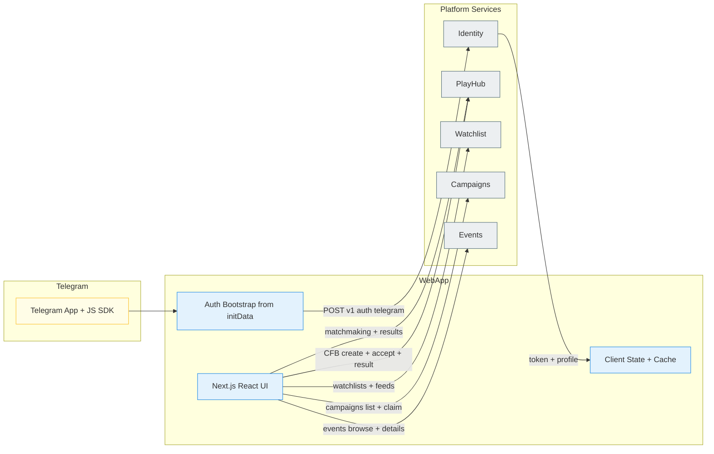
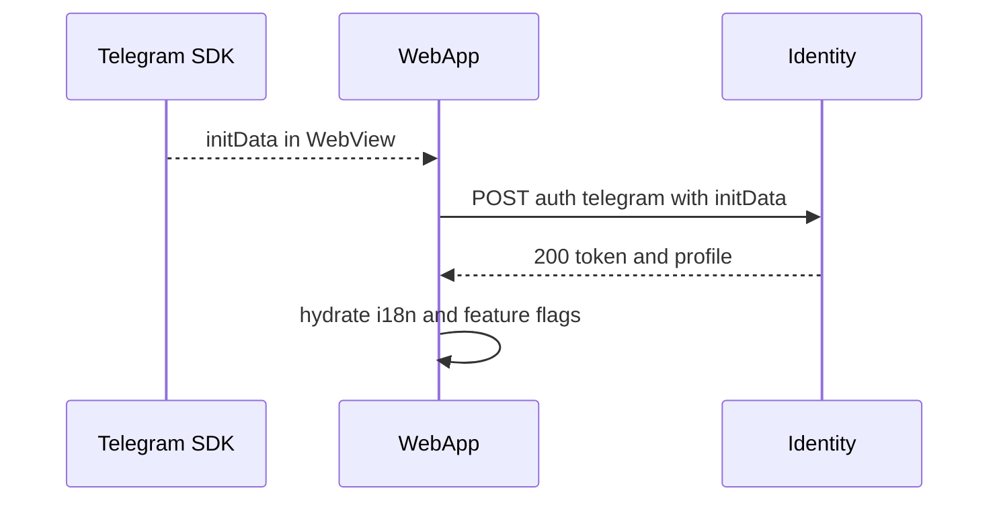
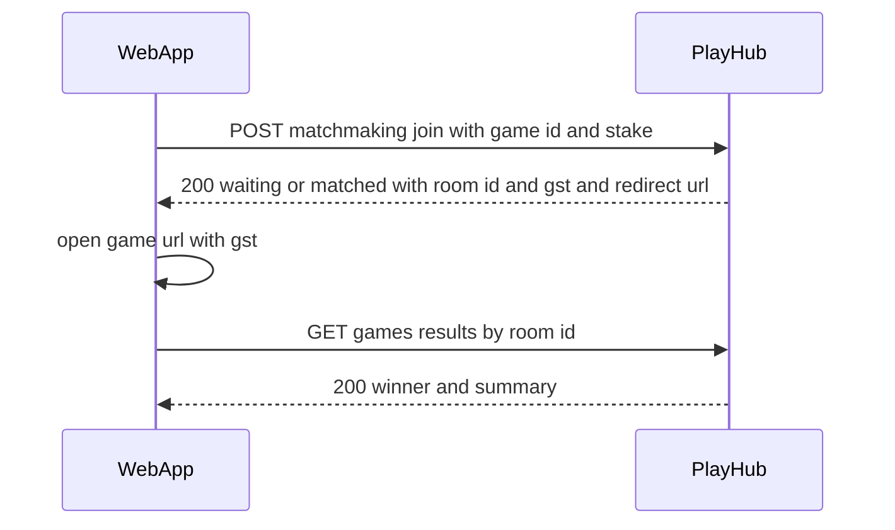
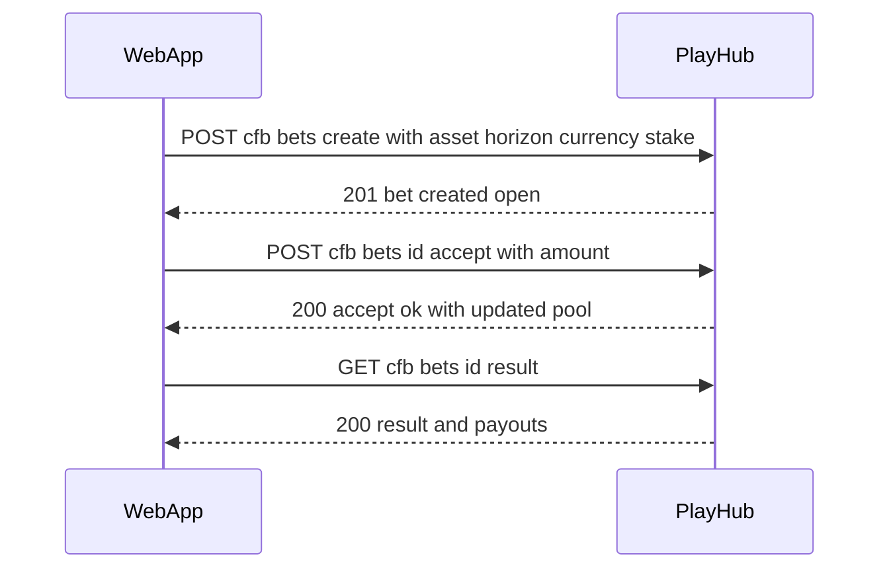

# Miniapp Webapp
*Version:* v0.2.0  
*Last Updated:* 2025-09-24 03:18 +07  
*Owner:* FUZE App Engineering — WebApp (Telegram Mini App)

> High‑level architectural blueprint for the **Telegram Mini App frontend**. This document covers UI architecture, integration contracts, client‑side state, data flows, security posture, and cross‑repo interoperability for MVP features: login, matchmaking and gameplay handoff, **CFB v1** bets, watchlists/feeds, campaigns, and events.

---

## 1) Architecture Diagram (HLD)

*Notes:* WebApp calls **public endpoints** of domain services. Payhub is never called directly by the client. Any balance snapshots shown come from domain responses (e.g., game results or optional summary endpoints).

---

## 2) Technology Stack
| Layer | Choice | Rationale |
|---|---|---|
| Framework | **Next.js** (App Router) with React | Ideal for Telegram WebApp; SSR/ISR optional |
| Language | TypeScript | Type safety and shared DTOs |
| Styling | Tailwind CSS + shadcn/ui | Fast, consistent UI |
| State | React Query + Zustand | Network cache and local UI state |
| Auth | Telegram JS SDK initData → Identity JWT | Simple and secure |
| Transport | fetch with retry and backoff | Standard, minimal deps |
| Telemetry | Sentry (optional) + Web Vitals | Production visibility |
| Build/Deploy | Next build + Docker | CI friendly |

---

## 3) Responsibilities and Scope
**Owns**
- Telegram WebApp bootstrap, capturing **initData**, and login with Identity.  
- Shell layout, navigation, localization, and theme.  
- Pages for: matchmaking and result view; **CFB v1** create, accept, and detail; Watchlists/Feeds; Campaigns; Events.  
- Client‑side cache and optimistic UX where safe.

**Not owned**
- Business logic and settlement (PlayHub and Payhub).  
- Price oracles (Price Service).  
- Admin tooling (separate repo).

---

## 4) Page Map
- `/` — Home hub with tabs: Play, CFB, Watchlist, Campaigns, Events.  
- `/play` — Games list and matchmaking join.  
- `/play/result/:roomId` — Verified results screen.  
- `/cfb` — CFB list and my bets.  
- `/cfb/new` — Create owner bet.  
- `/cfb/:id` — Bet detail, accept flow, countdown.  
- `/watchlist` — My watchlists and aggregated feed.  
- `/campaigns` — Active campaigns and claims.  
- `/events` — Browse and detail pages.  

---

## 5) Data Design — Client State
```
session: (token, exp, userId)
profile: (id, username, languageCode, roles, settings, area)

matchmaking: (status, roomId?, gst?, redirectUrl?)
cfbComposer: (asset, currency, horizon, ownerStake, closeAcceptAt)
cfbBetView: (betId, status, ownerStake, acceptPool, acceptors, timers)
feedsCache: keyed by (tab, filter)

requestMeta: (requestId, retryCount, lastError?)
```
Persistence: session token in memory + `sessionStorage` fallback (`tg-miniapp-session`). No secrets in `localStorage`.

---

## 6) Data Flows

### 6.1 Login and Bootstrap


### 6.2 Matchmaking and Gameplay Handoff


### 6.3 CFB v1 Create and Accept


### 6.4 Watchlists, Campaigns, Events
- Simple list to detail flows; client uses React Query caching and background refetch.

---

## 7) Security and Privacy
- **Token handling**: keep session token in memory with optional `sessionStorage` backup; never in URLs.  
- **Telegram verification**: client does not verify HMAC; server does.  
- **CSP**: strict policy; only API origins and allowed game hosts.  
- **XSS**: sanitize any user‑generated text; safe links for external sites.  
- **Clickjacking**: rely on Telegram WebView context; no external iframes except allowed game hosts.  
- **PII**: display names and usernames only; no precise location.  
- **Rate limit hints**: retries with backoff only on retryable errors; expose friendly error states.

---

## 8) Performance and Scalability
- React Query caching and background revalidation.  
- Static asset caching via immutable content hashes and CDN.  
- Route level code splitting and lazy loading for heavy pages.  
- Skeletons and optimistic updates where safe.  
- Optional service worker for read‑only caches (future).

---

## 9) Observability and Quality
- **Error tracking**: Sentry or similar; attach `requestId` to breadcrumbs.  
- **Metrics**: Web Vitals; custom events like `matchmaking_join_ok`, `cfb_accept_ok`, `result_fetch_time`.  
- **E2E**: Playwright tests in Telegram WebApp context; mock Identity and PlayHub.  
- **Accessibility**: semantic HTML, proper focus management, contrast.

---

## 10) Compatibility Notes
- Aligns with **Identity** token semantics and JWKS rotation; refresh on 401 then re‑login.  
- Matches **PlayHub** endpoints for matchmaking and **CFB v1**.  
- Updated to **Watchlist** service naming; uses `NEXT_PUBLIC_WATCHLIST_URL`.  
- Does not call **Payhub** directly; balances are shown only from domain responses.

---

## 11) User Stories and Feature List
### Feature List
- Telegram login and profile view.  
- Game selection, matchmaking join, gameplay handoff, and result view.  
- CFB v1: create, accept, browse, and result screens.  
- Watchlists and aggregated feeds.  
- Campaigns list and claim action.  
- Events browse and detail view.

### User Stories
- *As a new user*, I log in with Telegram and see a localized home screen.  
- *As a player*, I enter a stake and join a match, then be redirected to the game and later see my result.  
- *As a bettor*, I open a price bet and others accept with clear timers and payouts.  
- *As an explorer*, I browse token watchlists and news in one feed.  
- *As a participant*, I see campaigns and claim rewards when eligible.  
- *As an attendee*, I browse events and open external booking links.

---

## 12) Implementation Plan
- M1: Auth shell, layout, i18n, Identity integration.  
- M2: Matchmaking join and result flow, game handoff.  
- M3: **CFB v1** create and accept screens.  
- M4: Watchlist, Campaigns, Events tabs.  
- M5: Error tracking, web vitals, polish.

---

## 13) Risks and Mitigations
- **Token leakage** → never place tokens in URLs; only headers.  
- **Version skew with backends** → pin DTO versions and capability flags.  
- **WebView quirks** → feature detection for back navigation and viewport resize.

---

## 14) Future Work
- Push updates via SSE or WebSocket for results and feeds.  
- Partner theming and white‑labeling.  
- Offline cache for watchlists and event listings.
