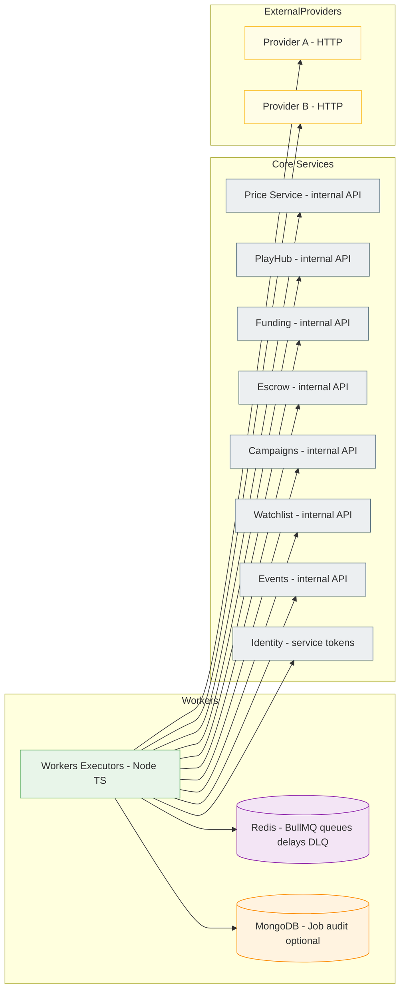
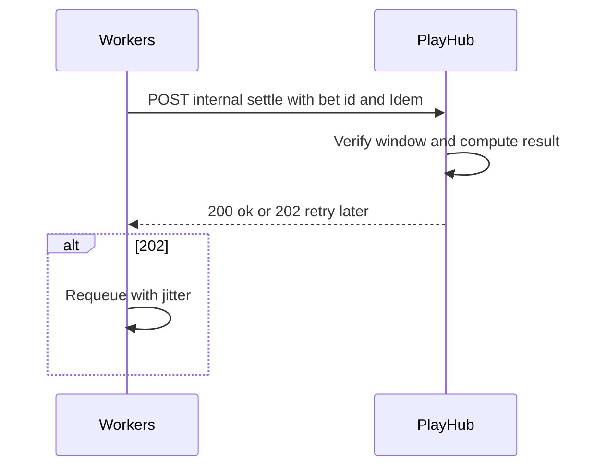
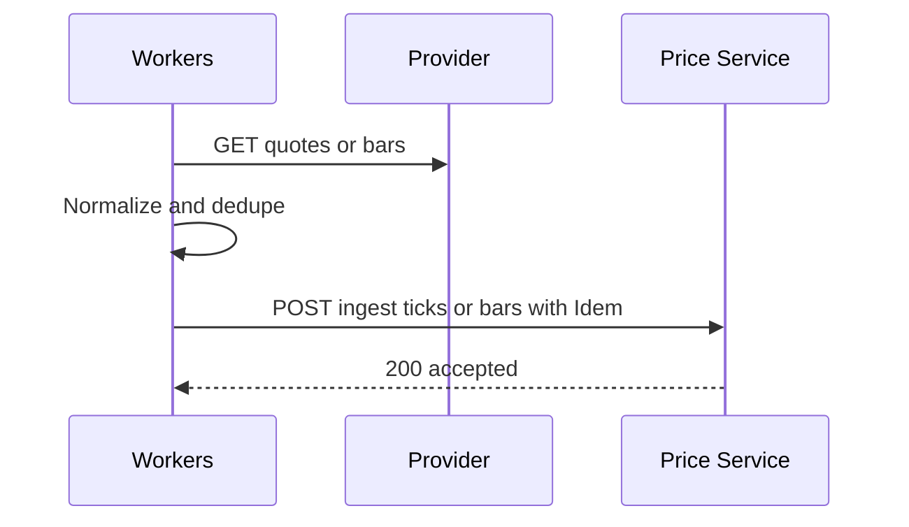
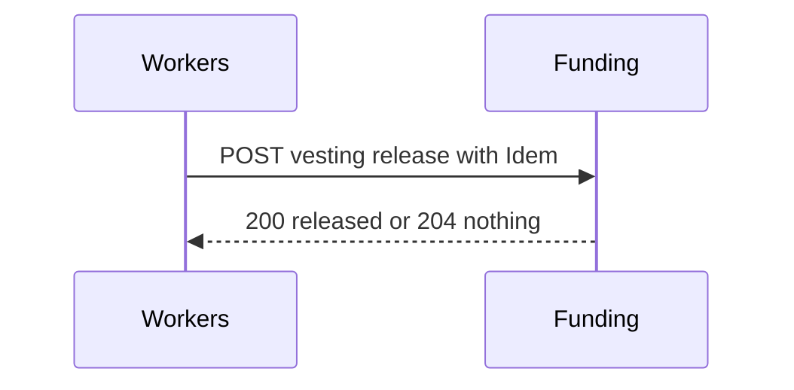

# Miniapp Workers
*Version:* v0.1.0  
*Last Updated:* 2025-09-24 02:51 +07  
*Owner:* FUZE Platform Ops — Schedulers, Ingestion, and Reliability

> High‑level architectural blueprint for the **Workers** service. Workers execute scheduled and background jobs for the platform: price ingestion and rollups, PlayHub **CFB v1** settlements, Funding vesting unlocks, Escrow expiries, Campaign retries, Watchlist ingestion, and utility tasks like exports. Workers are **stateless executors** that rely on Redis queues and call other services through **internal APIs** using service JWTs.

---

## 1) Architecture Diagram

*Notes:* Workers do **not** mutate ledgers directly and never call Payhub. They invoke domain services which in turn call Payhub. All tasks are **idempotent**, retried with exponential backoff, and recorded for audit when enabled.

---

## 2) Technology Stack
| Layer | Choice | Rationale |
|---|---|---|
| Runtime | Nodejs 20 plus TypeScript | Shared stack across repos |
| Queue | BullMQ on Redis | Delayed jobs, backoff, rates, DLQ |
| HTTP | undici fetch with retry | Efficient client for internal APIs |
| Auth | jose Ed25519 service JWTs | Allow listed service to service calls |
| Storage | Optional MongoDB | Persistent job audit and reports |
| Telemetry | OpenTelemetry plus Pino | Tracing and logs |
| Deploy | Docker plus Helm | Horizontal scale with queue based work |

---

## 3) Responsibilities and Job Catalog

### 3.1 Market Data Ingestion
- Poll approved providers on schedules like every minute.  
- Normalize ticks and bars; dedupe; post to **Price Service** ingest endpoints.  
- Monitor provider health and emit metrics.

### 3.2 PlayHub CFB v1 Settlement
- Schedule a settlement job at `T_end` for each open bet.  
- On execute: call **PlayHub** internal settle endpoint.  
- If the oracle is degraded, reschedule with jitter until window policy satisfied or timeout triggers **push**.

### 3.3 Funding Vesting Unlocks
- For each `VestingSchedule` with `nextReleaseAt <= now`, compute releasable units and call **Funding** internal release endpoint.  
- Handle partial releases and maintain idempotency by `vestingId` plus `epoch` key.

### 3.4 Escrow Expiries and Timeouts
- Scan or subscribe to expiry events.  
- Call **Escrow** internal expire route to move state to cancel or refund path.  
- Notify Admin if backlog builds.

### 3.5 Campaigns Retries and Reconcile
- Retry failed claim grants; backoff with jitter.  
- Periodic budget reconcile against granted totals.

### 3.6 Watchlist Ingestion
- Fetch curated sources (rss or api) and post normalized `NewsItem` to **Watchlist** internal ingest route with idempotency.

### 3.7 Utility Jobs
- CSV and JSON exports for Admin, executed via service endpoints.  
- Object storage cleanups using signed URLs provided by services.  
- Metrics flushers for page view aggregations from Events if enabled.

---

## 4) Data Flows

### 4.1 CFB Settle

### 4.2 Price Ingestion

### 4.3 Vesting Release

---

## 5) Reliability and Idempotency
- **At least once** execution: Every job may run more than once; all service endpoints must be idempotent.  
- **Idem keys**: `Idempotency-Key` built from job id and logic epoch (e.g., bet id plus end time).  
- **Backoff**: exponential with jitter; capped retries then moved to DLQ.  
- **Requeue policies**: specific status mapping (e.g., 409 conflict → success, 429 → retry).  
- **Poison pill isolation**: per job type circuit breaker to stop global impact.  
- **Graceful shutdown**: drain queues, checkpoint progress, release locks.

---

## 6) Security
- **Service JWTs** only; no end user tokens.  
- **Network**: internal cluster only; optional mTLS.  
- **Secrets**: provider keys and service JWT keys via secret manager.  
- **Audit**: record calls when `JOB_AUDIT_ENABLED` is true.  
- **Least privilege**: only call endpoints exposed by domain services.

---

## 7) Scalability and Performance
- Horizontal scale by increasing worker replicas; tune per queue concurrency.  
- Dedicated queues per domain to isolate load: `price`, `playhub`, `funding`, `escrow`, `campaigns`, `watchlist`, `events`, `utility`.  
- Rate limits and concurrency caps per provider and per service endpoint.  
- Redis sized for stream and delayed job volumes; use Redis Cluster if needed.

---

## 8) Observability
- **Tracing** spans per job with tags `queue`, `jobType`, `targetService`.  
- **Metrics**: jobs processed, successes, failures, retry rates, latency per job, provider health.  
- **Logs**: structured logs with `requestId` and redaction of secrets.  
- **Alerts**: DLQ size, retry spike, provider down, service error rate, queue latency SLO breach.

---

## 9) User Stories and Feature List
### Feature List
- Scheduled execution and delayed jobs per domain.  
- Price ingestion pipeline.  
- PlayHub settlement scheduler.  
- Funding vesting unlock executor.  
- Escrow expiry and refund triggers.  
- Campaign retries and reconcile.  
- Watchlist source ingestion.  
- Operator friendly metrics and DLQ handling.

### User Stories
- *As an operator*, I want CFB bets to settle on time even if a service restarts so that users trust outcomes.  
- *As a finance operator*, I want vesting releases to happen reliably so that allocations unlock on schedule.  
- *As a data engineer*, I want provider failures isolated and retried so that data quality remains high.  
- *As support*, I want failed jobs visible and recoverable via Admin.

---

## 10) Compatibility Notes
- Workers only call **internal** endpoints of domain services; no direct Payhub access.  
- Queues are isolated by domain to avoid noisy neighbor issues.  
- DTOs and error envelopes align with `tg-miniapp-shared`; schedules and flags come from `tg-miniapp-config`.
